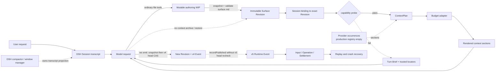
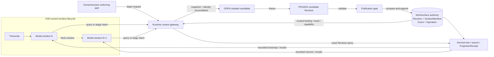
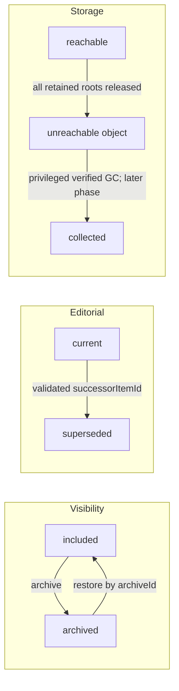

# WorkSurface Context-as-Repo 调研报告

- 审计日期：2026-09-04
- 审计范围：20 个固定 Revision 的开源仓库（5 个 core、9 个 adjacent、6 个 specimens）
- WorkSurface 基线：`f5fa25c46c2378af997d37e1f6b3045705c40811`
- 状态：研究结论已收敛；本文不修改 WorkSurface 实现，也不把候选设计视为已接受 Contract
- 固定源码：[sources.lock.json](sources.lock.json)

本文把内容明确分成两类：**Current** 表示固定源码中已经实现的事实；**Proposed** 表示由调研归纳出的下一步候选设计。

当前实现边界以[模型上下文](../../context-management.zh.md)、[实现索引](../../architecture.md)和[目标设计基线](../../design-baseline.md)为准。第三方源码 checkout 不进入 WorkSurface：`sources.lock.json` 固定 URL、Revision、许可证与本地路径，`sources/` 仅作为被忽略的本地审计工作区；可提交证据保存在 [`notes/`](notes/) 中。

## 1. 执行摘要

1. **Context-as-Repo 不是“把上下文放进文件”。** 更准确的定义是：repo 是可版本化、可寻址、可验证、可恢复的上下文权威；model window 只是某个精确 Revision 的一次有预算投影。
2. **已经有人沿这个方向实现。** 在本次样本中，Letta Code 最接近完整产品形态；Deep Agents、AICTX、AgentPlane、AIGNE 和 Memstead 分别提供 backend、continuity、provenance、mount ABI 与 schema/CAS mutation contract 的局部实践。
3. **Codex 的新机制不是 Context-as-Repo。** 它是 fresh-window + private History/Notes recall，主要解决 model window 生命周期，没有 host repo、Git authority、manifest、archive/restore 或领域 publication transaction。
4. **不能声称这些方案已被外部广泛采用。** 本次可以证明项目自身的 scoped default、opt-in、实验或模板状态；所有候选的外部生产部署数和活跃用户数仍未知。stars、下载量、发布频率和第一方集成都不能替代采用证据。
5. **WorkSurface 模板仍有价值。** 在所比较的 domain authority/replay 维度，WorkSurface 已有更完整的 immutable Revision、authority-qualified identity、Event、Contract、Operation、Settlement 与 replay 基础；目标范围也比 agent memory 更一般。
6. **首要缺口不是增加目录。** 应先收敛唯一权威 head、stable item identity、不可变 candidate、CAS publication、投影 receipt、archive/restore 和 fresh-window checkpoint。

**Proposed 目标定位**可以压缩成一句话：

> WorkSurface 接纳任意人类可读 repo，把它编译成 Runtime 管理的版本化上下文权威；模型按预算读取投影，所有写入先形成 candidate，只有校验和条件发布成功后才改变权威状态。

| 已确认事实 | 推荐决策（Proposed） | 仍待验证 |
| --- | --- | --- |
| 模板有价值，但固定目录本身不是差异化 | 保留 `surface.md`，把七段模板 Contract 化 | 不同 Surface 是否需要更多模板 schema |
| v4 publish 有 CAS；v5 ordinary apply/bridge 尚无同等级跨实例保证 | v5 成为唯一 head owner，写入统一走 candidate publication | cutover、旧 writer fencing 与 crash matrix |
| 自动投影绑定 immutable Revision，不追随最新 WIP | 固定 small bootstrap + revision-pinned retrieval | 真实 tokenizer、provider freshness 与最终请求 receipt |
| archive/restore 当前不存在 | archive、supersede、GC 分轴建模 | tool packaging：三个 dispatcher 还是多个小工具 |

## 2. 研究口径

### 2.1 操作性定义

一个系统至少形成以下闭环，才适合称为 Context-as-Repo：

```text
durable authority
  + stable addresses
  + bounded and discoverable projection
  + mediated reads and writes
  + revisions and provenance
  + lifecycle and recovery
```

以下机制有价值，但单独都不等价于 Context-as-Repo：

- compaction 只缩小 conversation 表示，不建立可寻址的长期权威；
- progressive disclosure 只控制何时读正文，不提供 revision、事务或恢复；
- Git-backed files 提供历史基础，但不自动提供领域权限、生命周期或跨存储事务；
- RAG/search 找到候选内容，不决定内容真伪、发布状态和 archive 状态；
- repo map 是派生导航，不是事实源；
- 把文件移动到 `archive/` 目录不等于稳定身份、可逆恢复和保留策略。

### 2.2 证据与采用分级

实现证据使用 `I/T/D/P/C/H`：implemented、tested、documented、prompt-only、claim/config、hypothesis。详细规则见[评估方法](notes/02-evaluation-method.md)。

采用分级只描述项目自身的 rollout：

- `S4 shipped-default (scoped)`：在明确范围内进入默认执行路径；
- `S3 shipped-opt-in`：已发布，但需要显式启用、挂载或初始化；
- `S2 early/experimental/template`：默认关闭实验、Alpha、年轻 substrate 或协议模板；
- `S1 paper/prototype`：论文或研究代码。

这些等级不描述市场规模。

## 3. 生态调研结论

| 项目 | 最早相关公开落点 | 当前可证明状态 | 成熟实践 | 关键边界 |
| --- | --- | --- | --- | --- |
| Aider RepoMap | 2023-05；2023-06 随 v0.5.0 发布 | S4，适用模型/repo 中的默认投影 | PageRank、定义/引用信号、token-fitted repo map、cache refresh | 只是代码导航 projection，不是 context authority |
| OpenHands SDK | 2025-09；2025-11 stable | S4，SDK 默认 condenser | append-only Event 与 disposable View 分离；保护 tool-call/result 原子边界 | 摘要有损，旧 Event 没有统一 repo retrieval |
| Deep Agents | 2025-07 filesystem；2026-05 ContextHub | 核心 filesystem/offload 是 S4；ContextHubBackend 是 S3 | BackendProtocol、大结果与 raw history 外置、metadata-first Skills；ContextHub commit/parent conflict replay | state/store/checkpointer 仍是不同平面；通用 lifecycle/CAS 未统一 |
| Letta Code | 2025-11 Skills；2026-01 文件 memory；2026-02 Git MemFS | capable backend 的普通新 agent 自 2026-06 起为 S4 | Git-backed memory、bounded tree/core、controlled mutation、post-turn sync、worktree recovery | 本次样本中最接近；local v1 compile-from-HEAD 与 API v2 层级 `MEMORY.md` 不能假定已合并为统一 backend |
| AICTX | 2026-04-24 continuity runtime | S3，Beta opt-in | canonical resume/finalize、bounded capsule、branch sensitivity、why-loaded/quality、local/portable split | 固定 coding taxonomy；普通写无统一 revision/CAS；厂商 adapters 不是厂商官方集成 |
| Codex TokenBudget + History/Notes | 2026-06 至 2026-09 | S2，受 eligibility 限制且默认关闭 | budget-aware fresh window、private History/Notes、bounded hint | window-centric private recall，不是 host repo 或 Git authority |
| AIGNE AFS / AgentPlane | 2025-10 / 2026-05 | S3 opt-in | provider/mount ABI；source/derived、provenance、freshness、scoped stage/validate/promote/rollback | AFS 缺强 revision/lifecycle；AgentPlane promotion 无 expected Git head 和 crash repair |
| Memstead / ContextFS | 2026 | Memstead rollout 未单独审计；ContextFS 为 S2 substrate | closed schemas、expected-hash、dry-run、typed errors；content-addressed snapshot、restore、GC | 前者不是通用 context runtime；后者不负责语义 projection/lifecycle |
| agent-mem / Agent OS / ACE | 2025–2026 | S1–S2 | `.context` 原型、owner-of-record/receipt protocol、增量 playbook | Alpha、模板或研究代码，不应作为广泛采用证据 |

完整候选和许可证边界见[来源清单](notes/00-source-inventory.md)，rollout 与采用证据见[采用度审计](notes/34-adoption-evidence.md)。无许可证的 specimens 只用于设计研究，不复制其代码或文案。

### 3.1 关键演进时间线

- **2023-05/06 — Aider**：repo map、PageRank 和 token fitting 进入可用版本，是本次样本中较早的成熟 repo projection。
- **2023-10 — MemGPT**：提出分层 memory 与 virtual context management，是概念前身，不是 repo protocol。
- **2025-07 — Deep Agents**：出现 state-backed file tools；2025-10 增加大结果/长期 memory 外置。
- **2025-11 — Letta Skills**：先注入 metadata inventory，再按需读取 `SKILL.md` 正文。
- **2026-01-27 — Letta**：文件化 memory、tree projection 和 hash/conflict 进入主干。
- **2026-02-11/12 — Letta**：Git-backed MemFS 进入主干；次日发布 [Context Repositories](https://www.letta.com/blog/context-repositories/) 公告。此时仍是 cloud-only opt-in，后来能力不能倒推到该日期。
- **2026-04-24 — AICTX**：continuity store/loader/handoff/decision/failure 随 4.0.0 发布。
- **2026-05-12 — Deep Agents**：有 commit/`parent_commit` 冲突处理的 `ContextHubBackend` 随 0.6.0 发布为 LangSmith opt-in backend。
- **2026-06 至 09 — Codex**：无摘要换窗、History/Notes、hint 和组合实验依次进入主干与发布。
- **2026-08-17 起 — WorkSurface**：开始形成当前体系；08-30/31 完成 durable-events/fact-backed context 架构重构。

这些日期只证明公开落点先后，不能证明 OpenAI、Letta 或其他项目之间存在借鉴或复制关系。完整 commit/PR 时间见[演进时间线](notes/30-evolution-timeline.md)。

### 3.2 Codex 时间线纠偏

- [#27488](https://github.com/openai/codex/pull/27488)，2026-06-11：只加入 direct-model-only `new_context`；同一 Revision 的 token-limit auto path 仍会调用旧 compaction。
- [#29743](https://github.com/openai/codex/pull/29743)，2026-06-23：才让 **TokenBudget 模式**的 manual/auto 路径跳过 model/server summary 并进入 fresh window；非 TokenBudget compaction 仍存在。
- [#39827](https://github.com/openai/codex/pull/39827)，2026-08-21：加入 4 个 History 与 5 个 Notes 工具。Notes 是 Codex backend 的 private virtual path，不是项目文件或 Git repo。
- [#40539](https://github.com/openai/codex/pull/40539)，2026-08-25：新窗口最多注入 4,000 bytes 的 `thread_hint`。
- [#42385](https://github.com/openai/codex/pull/42385) 与 [0.153.0](https://github.com/openai/codex/releases/tag/rust-v0.153.0)，2026-09-03：组合能力才以默认关闭、受 eligibility 限制的实验功能公开。

OpenAI API 另有 [`/responses/compact`](https://developers.openai.com/api/reference/java/resources/responses/methods/compact)，返回供后续请求继续使用的压缩对象。它说明 OpenAI API 支持 conversation compaction，但不能证明 Codex CLI 的实验默认开启，也不建立 repo authority。

## 4. WorkSurface 当前实现

### 4.1 当前上下文路径



### 4.2 已有基础与实际缺口

| Current：已有基础 | Current：实际缺口 |
| --- | --- |
| `surface.md` + 任意普通文件可形成 content-addressed immutable Revision | `surface.md` 七标题是硬编码常量；其他文件没有 role/load policy/lifecycle/media metadata |
| Session 绑定精确 Revision；有小型 guidance、Turn Brief 和 locator | 自动投影的是 bound Revision，不是最新 mutable WIP；旧 DSH capability probe 失败时整层跳过 |
| ContextPlan/RenderManifest 有 as-of、included/omitted 和 hash 骨架 | 真实 DSH messages 仍全量派生；该 manifest 不是最终 model request 的完整 receipt |
| provider occurrence 有 phase/lifetime/timeout/settlement/replay 基础 | production provider registry 为空；roster/version identity 和 required-content 语义未闭合 |
| v4 publish 在 subject lock 内执行 expected-head CAS | v5 ordinary apply 只有单实例 queue；`recordPublished()` 记录 expectedRevision 但不复核 v5 head，形成双 head 风险 |
| Event/Contract/Input/Operation/Settlement 支持 durable record 与 replay | 没有 context archive/restore；maintenance provider 和 fresh-window checkpoint 尚未实现 |
| Revision store 接受任意普通文件 | adapter 会把文件直接按 UTF-8 解码，尚无真实 modality handling 或 `unsupported-modality` receipt |

针对上述事实，本次重跑 7 个 WorkSurface 定向测试文件，45/45 通过；这不是全仓完整测试套件。详细实现证据见[当前实现审计](notes/40-worksurface-current-state.md)。

## 5. WorkSurface 与 OpenAI 图的差异

用户给出的 OpenAI 图描述的是 **summary-compaction 的 model window 生命周期**：conversation/tool results 累积，到达阈值后压成 summary，再继续推理。后来出现的 Codex TokenBudget fresh-window 实验是另一条实现路径，不能倒推为原图本身已经表达了 fresh window。

WorkSurface 解决的是另一个维度：**任务世界状态的 authority 生命周期**。

| 问题 | OpenAI compaction / Codex experiment | WorkSurface（Current / Proposed） |
| --- | --- | --- |
| 核心对象 | model conversation window | Surface Revision + Event + Operation |
| 超限动作 | 原图是 summary compaction；TokenBudget 实验另走 fresh window | Current：由 DSH 管；Proposed：换窗前形成持久 checkpoint |
| 旧信息位置 | transcript/compacted item；实验中为 private History/Notes | immutable Revision、Event、blob、authoring WIP |
| 恢复方式 | hint + private list/search/read | Current：exact bound Revision + 现有 projection/replay；Proposed：bounded projection + canonical refs + pending-state checkpoint |
| 真相源 | conversation/backend session state | Runtime-qualified Surface authority |
| 写入 | private Notes 或普通工具副作用 | Current：publish/apply 路径；Proposed：candidate → validate → CAS publish |
| Archive | 无一等 archive/restore | Current：没有；Proposed：稳定 item identity 下的可逆 lifecycle |
| 目标 | 让长对话继续推理 | 让上下文独立于任一窗口，并可审计、协作和恢复 |

所以两者可以组合，但不能互相替代：

```text
Codex context management = window paging + private recall
WorkSurface              = revisioned context authority + compiled projection
```

## 6. Proposed：目标架构



建议固定四个 WorkSurface 平面，并把 DSH-owned Window 明确放在外部：

- **Authoring**：人类友好的 mutable WIP；不是 published truth。
- **Candidate**：隔离、可变的 OPEN workspace；freeze 后成为不可变 candidate Revision。
- **Authority**：唯一 head、immutable Revision、SurfaceManifest、Event/Contract/Operation/Settlement。
- **Projection**：tree/index/search/cache/ContextPlan/ProjectionReceipt；全部可重建。
- **Window**：一次短暂、有预算的消费视图，由 DSH 管理生命周期。

### 6.1 Repo 模板与 Manifest

- 保留 `surface.md` 作为唯一 required entrypoint，并设置硬大小上限。
- 当前 Goal、Acceptance Criteria 等七段保留为有价值的默认模板，但改成受信任、版本化的 `templateId + templateSchemaDigest` Contract，而不是所有未来 Surface 永久写死的 Runtime 常量。
- 允许任意业务目录；Runtime 不硬编码 `active/`、`archive/`、`notes/` 等路径。
- 权威 `SurfaceManifest` 由 Runtime 生成并被 Revision hash 覆盖，绑定唯一 active `surface.md` entrypoint、`templateId/templateSchemaDigest`，并维护稳定 `itemId → path/blob/mediaType/role/loadPolicy/visibility/editorialState/provenance`。
- `ContextProjectionManifest` 从 exact Revision、provider roster 和 projection policy 确定性生成，可删可重建，不与 `SurfaceManifest` 争夺事实源。
- entrypoint 不得 archive；supersede entrypoint 时，必须在同一次 publication 中提供通过模板校验的新 active entrypoint。

### 6.2 Runtime 最小 ABI

| 版本化对象 | Runtime 必须知道什么 | 用途 |
| --- | --- | --- |
| `SessionBinding` | trusted Surface/Session、Revision、event cursor、capability、`rosterDigest` | 身份、隔离、cold start、授权 |
| `RevisionEnvelope` | schema version、surface/revision identity、parent(s)、manifest/tree root、publication event cursor | 精确权威版本、拒绝未知语义 |
| `SurfaceManifest` | 唯一 active entrypoint、template contract、stable itemId、path/blob、media type、role、load policy、lifecycle、provenance | 自动装载、move/archive/restore、完整性 |
| `ProviderRoster` | provider descriptor、implementation/config identity、capabilities、freshness policy 及其 digest | 让 `rosterDigest` 可解析、可校验而非孤立哈希 |
| `CanonicalRef` | logical item 与 immutable item-version/file/fragment/range/record/blob/provider refs | 精确读取、引用、diff、历史恢复 |
| `ProjectionReceipt` | source Revision、policy/roster digest、budget、included/omitted/truncated/freshness | 诚实说明模型看到了什么、没看到什么 |
| `CandidateRecord` | OPEN/FROZEN、base head、authoring/working/candidate digest、operation id | 防 TOCTOU、并发和恢复 |
| `Validation/PublicationReceipt` | candidate/policy/head 绑定、commit outcome、event/settlement refs | 条件发布、幂等与审计 |

所有 durable envelope 都必须显式版本化；未知 schema/version 一律 fail closed。

自动装载仅包括：小型 Runtime contract、trusted SessionBinding、预算内完整 `surface.md`、bounded logical tree。普通正文、archive、完整 manifest 和 provider bulk 默认 deferred，由模型按需读取。

canonical ref 至少区分：

```text
surface-item(surfaceId, itemId)                     # 跨 Revision 的逻辑身份
surface-item-version(surfaceId, revision, itemId, blobDigest)
surface-fragment(... parserId, parserVersion, fragmentId, digest)
surface-range(... byteStart0, byteEnd0Exclusive, blobDigest)
surface-record(... adapterId, adapterVersion, schemaDigest, recordId, digest)
session-event(sessionId, seq, contentHash)
blob(blobId, contentHash)
provider-resource(providerId, locator, resourceRevision, digest)
```

逻辑 `surface-item` 的解析必须带显式 `atRevision`（或显式一致性策略），不得悄悄追随 latest。provider 的易变内容若进入 durable authority，先摄取为 immutable blob/version；`baseRevision`、`expectedHead`、`authoringDigest`、actor 和 capability 均由 Runtime 提供或复核。

### 6.3 模型上下文操作面

先固定逻辑操作，不急于冻结为恰好三个物理 tool schema；三个 dispatcher 与多个小工具需要按 schema token、provider 约束、并行和授权能力实测。

| 操作面 | 主要 action | 文件/权威效果 | 必须返回 |
| --- | --- | --- | --- |
| query | overview、tree、stat、read、search、resolve、diff、history | 只读 exact Revision 或显式 candidate scope | resolved ref、Revision、range/cursor、freshness、truncation/completeness |
| stage | begin、write、patch、move、archive、restore、supersede、freeze、discard | 只改变隔离 candidate；move 改 itemId→path；lifecycle 改 manifest | candidate state/digest、prospective diff、validation diagnostics |
| publish | validate、commit | validate immutable candidate；commit 只条件推进唯一 head | policy-bound receipt、new Revision/event、typed conflict、projection readiness |

工具作用于逻辑对象和 candidate；文件只是某个 Revision 下的物化表示。在 Context-as-Repo 模式中，普通文件写只能落入 authoring WIP 或 OPEN candidate，不能绕过 freeze、manifest reconciliation 和 publication。模型只提交 target、delta 和 reason；Runtime 提供或复核 `baseRevision`、`expectedHead`、`authoringDigest`、actor 与 capability。query 必须钉住 exact Revision/candidate scope，逻辑引用解析必须显式给出 `atRevision`。模型不能直接写 head、Event log、generated manifest、receipt、provider registry、trust policy、物理 delete 或 GC。

### 6.4 Archive、supersede 与 GC



- archive 是 `visibility=included → archived`，不会自动改变 editorial state，也不等于移动文件；
- supersede 是独立的 editorial transition，必须验证 successor 并拒绝 cycle；
- restore 使用 Runtime 分配的 `archiveId`，保留 source item version、旧 path/role、provenance 和 lifecycle sequence；
- archive/restore 都经 candidate + publication；默认 projection 排除 archived，但有权限的 query 必须能显式发现它；
- lifecycle publication 必须在一次 authority append 中原子关联新 Revision、transition 和 immutable `ArchiveRecord`；candidate manifest 保存 `archiveId`，完整 record 可以引用已提交 Revision，避免自引用 hash；
- 首版不新增或暴露语义 item/blob GC；沿用现有 RevisionStore 的低层保留/GC，但不得把它等同 archive。所有可恢复 archive 都作为 strong root。后续若做 item/blob GC，必须单独设计 retention、strong/weak refs、in-flight leases、atomic root snapshot 和 privileged sweep。

### 6.5 Publication 与恢复

候选协议为：

```text
begin(baseRevision, authoringDigest)
  -> OPEN candidate + base-to-snapshot identity reconciliation
  -> stage edits/lifecycle transitions
  -> freeze immutable candidateRevision
  -> validate(candidateRevision + policyDigest)
  -> durable OperationPrepared (put-if-absent)
  -> compareAndAppend(expectedHead) in the single v5 head store
  -> recoverable outbox rebuilds authoring/v4 compatibility/index projections
  -> idempotent Settlement
```

关键约束：

- Proposed：v5 RuntimeEventStore 成为唯一 Surface head owner；v4 只保留携带 v5 commit ref 的兼容 projection。
- 迁移需要 durable cutover fence 和旧 writer fencing；只在启动时比较一次 v4/v5 head 不足以防止之后分叉。
- 初始 `create/admit(expectedHead=null)` 也走完整 candidate/validate/Prepared/CAS 流程；`head()` 只读，不从 mutable authoring 隐式 admission。
- `OperationPrepared` 用 put-if-absent 绑定 `idempotencyKey + operationId` 以及 candidate/base/head/policy/validation/actor/outbox digests；同 key 不同 payload 必须拒绝。
- publication lock 内重新验证 candidate digest、policy/capability 和 expected head；commit Event 携带 operation identity。恢复只能用匹配 Event 判定已提交，不能以 `head == candidate` 猜测；lifecycle commit 同一 Event 还关联 `ArchiveRecord`。
- authority head 推进后只做 forward recovery。outbox 回写 authoring 前再次比较 authoring digest；若出现新 WIP，保留它并报告 materialization conflict，绝不覆盖。
- fresh window 不能切断未完成的 tool-call/result 对。允许 published、discarded、durable pending candidate/WIP 三种 checkpoint 状态；换窗不应强迫模型在最后一刻写一篇新摘要。

字段级事务、cutover 和 GC roots 细节保留在[综合技术结论](notes/50-synthesis.md)，实现前应再冻结为独立 RFC 和 invariants。

## 7. 跨项目综合与设计护栏

最值得组合的是：Letta 的 exact source Revision → compiled context Revision，AICTX 的 bounded resume/quality，Deep Agents 的 backend/offload，Memstead 的 closed schema/CAS receipt，OpenHands 的 authority/view 分离，Aider 的 budget router，以及 ContextFS 的 durable ref/restore substrate。各项目的适用边界已经列在第 3 节，不能把局部优点合并想象成某个上游已经拥有的完整系统。

设计护栏：

- 不创建脱离 Surface authority 的第二套 private Notes 真相源；
- 不把所有根 Markdown 永久塞入每次 model request；
- 不把 model summary 当唯一 durable checkpoint；
- 不让 `git commit` 冒充领域 transaction；
- 不把 archive 只实现成 prompt convention、目录名或 growing archive file；
- 不暴露 delete/GC、force publish、trust/provider policy mutation 给普通模型；也不从 POSIX-looking path 推断 persistence、versioning 或 isolation；
- 不让 tool roster、provider registry 与运行时 capability 分别手工维护。

## 8. 实施顺序与退出条件

### M0：冻结术语和 ABI

- 交付：Current/Proposed 边界、`SurfaceManifest`、stable item identity、canonical refs、ProjectionReceipt、template Contract。
- 退出条件：schema round-trip、未知版本 fail closed、相同 Revision 确定性生成相同 projection manifest。

### M1：单一 authority 与恢复

- 交付：v5 single head、cross-instance compare-and-append、cutover fence、immutable candidate、Prepared/outbox/Settlement。
- 退出条件：stale head、two-runtime competition、old writer after cutover、same-key/different-payload、每个 crash boundary 和 authoring WIP conflict 均有测试。

### M2：只读 Context-as-Repo

- 交付：`surface.md` + bounded logical tree bootstrap，以及 Revision-pinned overview/read/search/diff。
- 退出条件：receipt 能报告 exact Revision、scope/policy/roster digest、cursor、freshness、truncation 和 modality omission；未找到不被误报为完整不存在。

### M3：受控 mutation 与 lifecycle

- 交付：OPEN/FROZEN candidate、write/patch/move、archive/restore/supersede、ArchiveRecord。
- 退出条件：candidate TOCTOU、rename identity、archive idempotency、restore path conflict、successor cycle 和并发发布均锁定。

### M4：长任务窗口与 provider

- 交付：tool-boundary-safe checkpoint、small resume capsule、pending WIP locator、真实 tokenizer/budget reserve、生产 external provider。
- 退出条件：fresh window 后无需旧 transcript summary 即可从 Revision + locators 恢复；provider failure/freshness/roster change 均有诚实 receipt。

## 9. 最终结论

WorkSurface 不应放弃现有模板，但应重新定义模板的价值：

```text
arbitrary human-friendly repo
        ×
small machine-verifiable ABI
        ×
runtime authority and publication
        ×
bounded projection and lifecycle
```

Runtime 固定的是契约，不是目录学；repo 保存的是权威上下文，不是另一份不可核验摘要；模型修改的是 candidate，不是 head；archive 是可逆 visibility，不是删除。

本次样本没有找到一个同时闭合这四个交界面的公开实现。因此 WorkSurface 不是简单重复 Letta、AICTX 或 Codex，而是有机会把已经出现的 repo-local memory、渐进披露和窗口管理机制，收敛成 DSH 内通用、可事务、可恢复的 context authority。

## 10. 证据索引与验证状态

- [来源与许可证清单](notes/00-source-inventory.md)
- [固定 checkout 验证](notes/01-checkout-verification.md)
- [评估方法](notes/02-evaluation-method.md)
- [成熟实践提炼](notes/10-mature-practices.md)
- [演进时间线](notes/30-evolution-timeline.md)
- [核心项目机制审计](notes/31-core-mechanism-audit.md)
- [相邻机制审计](notes/32-adjacent-mechanism-audit.md)
- [补充候选审计](notes/33-late-candidates-audit.md)
- [采用度审计](notes/34-adoption-evidence.md)
- [Deep Agents 审计](notes/35-deepagents-audit.md)
- [AICTX 审计](notes/36-aictx-audit.md)
- [WorkSurface 当前实现审计](notes/40-worksurface-current-state.md)
- [综合技术结论与字段级候选协议](notes/50-synthesis.md)

截至审计日：20 个 source checkout 均与 `sources.lock.json` 的 Revision 一致且工作树干净；WorkSurface 基线工作树干净，7 个针对性测试文件 45/45 通过。外部项目测试范围及未运行项见各专项审计，不将定向测试外推为完整生产验证。
