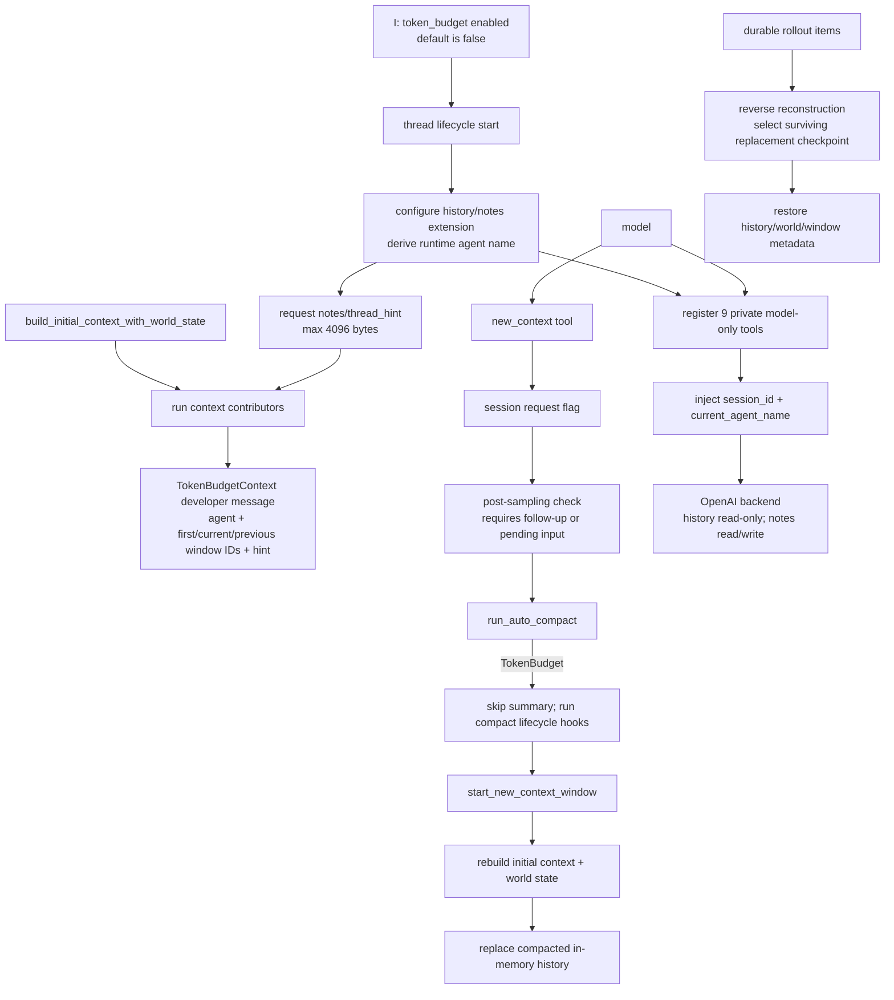
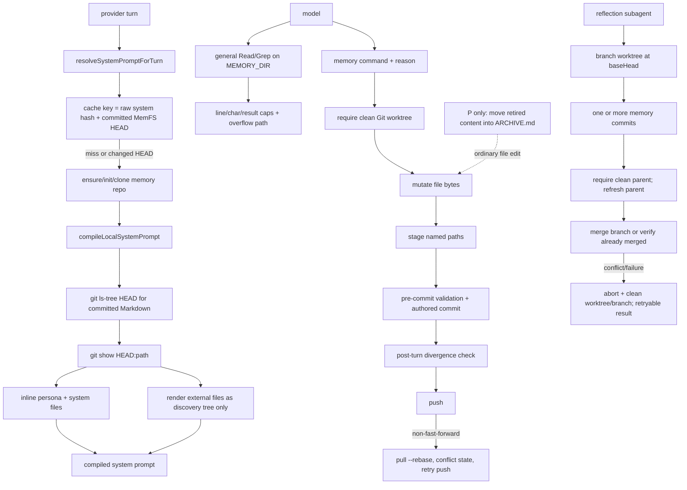
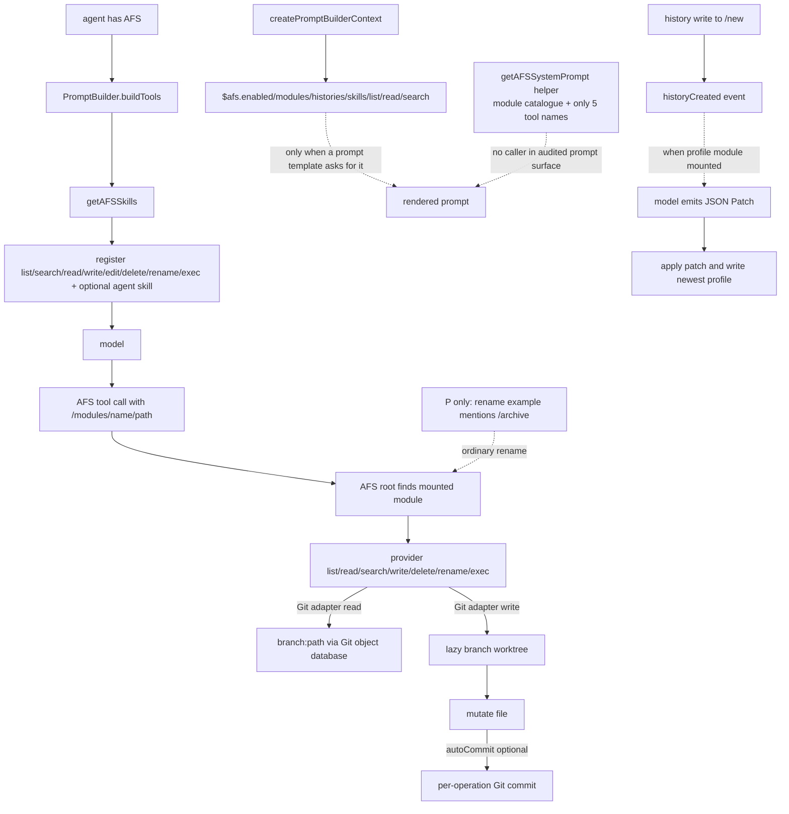
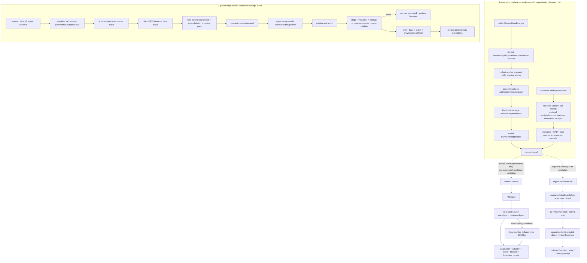

# Core mechanism audit: Codex, Letta, AIGNE, and AgentPlane

This note is a source-level audit of four adjacent systems against the mechanics needed by a
Context Repository. It answers a narrower question than “does this project use files?”: what is
actually bootstrapped, how context is addressed and loaded, what freshness and write guarantees
exist, and whether archive/recovery are runtime states or merely conventions.

## Audit basis

All claims below refer to these pinned revisions. The sizes are the on-disk sizes of the blobless,
sparse audit checkouts on 2026-09-04; they are not upstream repository sizes.

| Alias | Repository | Pinned HEAD | Sparse checkout size |
| --- | --- | --- | ---: |
| `C` | `openai/codex` | `8e6a44b428e31f91b21edc97904fcdf4f0931ade` | 20M |
| `L` | `letta-ai/letta-code` | `feb32e33c4f4badd546e75b70ef202283d6580da` | 8.1M |
| `A` | `AIGNE-io/aigne-framework` | `441f59b446182cdfc7462e1a16520a61dc40a5f9` | 3.8M |
| `P` | `basilisk-labs/agentplane` | `fa693664b5fb4f7884b5c772b456357518732bd4` | 21M |

Paths such as `C/codex-rs/...` below are relative to
`docs/research/context-as-repo/sources/core/openai-codex`; the other aliases resolve analogously to
`letta-code`, `aigne-framework`, and `agentplane`.

Evidence labels follow `02-evaluation-method.md`:

- `I` — executable implementation at the pinned SHA;
- `T` — an automated test at the pinned SHA;
- `D` — documentation only;
- `P` — prompt/instruction only;
- `—` — no contract was found in the audited surface.

`I (scoped)` means the mechanism exists, but only for the named workflow or backend. “No contract
found” is intentionally narrower than claiming that an opaque remote service cannot implement one.

## Bottom line

None of the four implements the whole Context Repository contract.

1. **Letta is closest to a Git-backed, self-editable agent context plane.** A committed memory
   revision participates in system-prompt cache invalidation; core files are compiled into the
   prompt, deferred files remain discoverable, writes create authored commits, and reflection work
   is isolated in a worktree. It still lacks a versioned repository manifest, projection receipts,
   expected-head writes, and a first-class archive/restore state machine.
2. **AgentPlane has the strongest explicit schemas, provenance, freshness checks, bounded inclusion
   receipts, and workflow journaling.** Its extraction writer has the only multi-file stage/validate/
   promote/rollback routine in this set. But its optional context knowledge plane is explicitly
   separate from runner prompt assembly, and the transaction is narrow: it is not a general
   context-repository commit protocol.
3. **AIGNE has the cleanest provider/mount abstraction.** `/modules/<name>/...` plus an adapter ABI
   makes heterogeneous stores look like a file system. At the pinned revision, however, the actual
   automatic wiring is the nine AFS tools. The helper that would print a module catalogue and only
   five tool names has no caller in the audited prompt surface; it must not be reported as an
   automatic bootstrap manifest.
4. **Codex implements context-window rollover without model/server summarization and private,
   bounded history/notes retrieval.** That is progressive disclosure across windows, not
   “context as repo”: addresses are backend-private window/item IDs and virtual note paths, the
   backend is opaque, the feature is off by default, and there is no project-owned manifest,
   archive lifecycle, or client-visible revision/CAS contract.

The useful synthesis is therefore not to copy one project. It is to combine AIGNE's provider ABI,
Letta's commit-addressed future-context compilation and worktree isolation, AgentPlane's typed
addresses/receipts/transactions/journal, and Codex's no-summary window reset with retrieval.

## Capability matrix

| Mechanism | Codex | Letta | AIGNE | AgentPlane |
| --- | --- | --- | --- | --- |
| Bootstrap / manifest | `I (scoped)`: window metadata + optional 4 KiB thread hint; feature default-off. No project manifest. | `I`: prompt compiled from committed MemFS revision. No versioned repo manifest; v1/v2 layout is inferred. | `I`: mounted providers become tools; template context can enumerate modules. The catalogue helper is not wired. | `I`: versioned context layout schema and prompt-module graph both exist, but context knowledge is not automatically part of runner bootstrap. |
| Addressing | `I`: agent + opaque window/item IDs; virtual note paths. | `I`: per-agent filesystem paths and Git HEAD; v2 `MEMORY.md` indexes gate nested paths. | `I`: `/modules/<provider>/<provider-path>`; Git adapter adds encoded branch segment. | `I`: file/line/section/JSONL identities, digest-addressed `KnowledgeRef`, and stable prompt-module addresses. |
| Bounded read / search | `I`: range/offset/result fields and server-applied output budget. | `I (partial)`: read/tree/output caps and overflow receipts; files are read in full after a 10 MiB guard; `grep head_limit=0` is unlimited before the output clamp. | `I (partial)`: model-facing read is capped after a full adapter read; list/search limits are optional at the generic ABI, though Git clamps to 1000. | `I`: paginated search, stale-row rejection, 200-file fallback, and bounded prepared excerpts. `context show` still reads the whole file before selecting. |
| Freshness / provenance | `I (weak)`: consistency timing is documented in executable tool descriptions, but no source digest or revision receipt. | `I (medium)`: Git HEAD invalidates compiled prompt; commits record author/reason. No per-fragment selection/omission receipt. | `I (weak)`: timestamps/provider metadata only; Git reads do not return resolved commit or content digest. | `I (strong)`: source, projection, content digests; fresh/stale/missing states; source refs; prompt-module provenance and omission receipts. |
| Write transaction | `I single-call / — transaction`: replace or append one opaque note; no expected revision. | `I commit / partial transaction`: clean-tree gate then mutate files and commit named paths; commit failure unstages but does not restore bytes. | `I single-call / — transaction`: adapter mutation, optional per-file Git commit; no stage/validate/publish or expected revision. | `I (scoped)`: extraction artifacts stage, validate, back up, promote, post-validate, rollback. Not a general repo write API and not crash-atomic across files. |
| Archive / restore | `—`: no action in the nine history/notes tools. | `P`: reflection prompt prescribes `ARCHIVE.md`; Git history exists, but no typed archive/restore command. | `P`: rename description gives `/archive` as a move example; delete is permanent; no lifecycle API. | `I epistemic states / — archive`: `deprecated` and `superseded` are real statuses; `.archive` appears in a test convention, but no archive/restore command or reversible state transition exists. |
| Concurrency | `I (weak client contract)`: note writes are marked non-parallel; no CAS/revision. Opaque backend may do more. | `I (medium)`: clean-tree gate, non-fast-forward barrier, rebase, and reflection worktrees; no expected-head on ordinary writes. | `I (weak)`: per-branch worktrees exist, but fetch/pull/push and writes have no lock or CAS. | `I (workflow-local)`: exclusive `wx` source-set/execution leases, semantic fingerprints, and monotonic phases; no distributed lease or general Git expected-head. |
| Recovery | `I`: rollout reconstruction replays from surviving compaction checkpoints; history tools can recover older private items. | `I`: Git history, startup pull/rebase, backup ref before hard reset, typed conflict outcomes, and worktree cleanup. | `I (storage-dependent)`: Git commits/worktrees are recoverable manually; no runtime replay or failed-transaction journal. | `I (workflow)`: ingest journal and fingerprints allow bounded resume and detect drift; rollback data is kept if rollback fails. A process crash during multi-file promotion has no audited startup repair loop. |

## 1. Codex: fresh windows backed by private retrieval, not a repository

### Actual call chain



The key distinction is that the fresh window does not carry a generated summary. It reconstructs a
small initial context and expects the model to recover details through private tools. The persistent
authority visible in this checkout is still the rollout plus an external service, not a workspace
repository.

### Mechanism evidence

1. **Bootstrap / manifest — `I (scoped)`.** `TokenBudget` and `ContextManagement` are both
   `UnderDevelopment` and disabled by default
   (`C/codex-rs/features/src/lib.rs:1579-1589`). The history/notes extension is activated only when
   its token-budget option is on, the provider is OpenAI, and Codex-backend auth is in use
   (`C/codex-rs/ext/history-notes/src/extension.rs:45-63`). On thread start it derives the agent path
   from runtime session identity rather than trusting model input
   (`C/codex-rs/ext/history-notes/src/extension.rs:66-81`). A thread hint is fetched with a 4096-byte
   truncation policy and inserted in the context-window slot
   (`C/codex-rs/ext/history-notes/src/extension.rs:97-150`). Initial context folds extension
   contributions into window hints and emits agent/window IDs in a separate developer message
   (`C/codex-rs/core/src/session/mod.rs:3913-3988`, `3990-4058`;
   `C/codex-rs/core/src/context/token_budget_context.rs:39-75`). There is no project layout or
   manifest ABI in this chain.
2. **Addressing — `I`, but private and rollout-scoped.** History uses an agent name plus full opaque
   window ID and short item ID. Notes use virtual paths rooted at `<agent_name>/notes`, explicitly
   not filesystem paths (`C/codex-rs/ext/history-notes/src/tools.rs:24-28`). The runtime injects
   `session_id` and `current_agent_name` into every backend call
   (`C/codex-rs/ext/history-notes/src/backend.rs:29-46`). This is a good authority boundary, but not
   a repo-path contract.
3. **Bounded read / search — `I`.** The nine actions are enumerated and mapped to versioned backend
   endpoints (`C/codex-rs/ext/history-notes/src/tools.rs:30-100`). Schemas expose window/item limits,
   per-item character limits, character offsets, line ranges, and search/file caps
   (`C/codex-rs/ext/history-notes/src/tools.rs:142-235`). The output says the server applies the
   requested budget before encrypting the response
   (`C/codex-rs/ext/history-notes/src/tools.rs:331-343`). The client schemas frequently make those
   caps optional, so the hard default/max remains an opaque-backend responsibility.
4. **Freshness / provenance — `I (weak)`.** Executable tool descriptions promise that history and
   list/search indexes are eventually consistent, while successful note writes are immediately
   visible to direct reads; note size is capped at 1,000,000 UTF-8 bytes
   (`C/codex-rs/ext/history-notes/src/tools.rs:24-28`). Responses do not expose a note revision,
   source digest, selection receipt, or resolved history snapshot. Search/write arguments are marked
   encrypted, and authenticated backend requests carry a truncation-policy header
   (`C/codex-rs/ext/history-notes/src/backend.rs:55-88`), which is confidentiality plumbing rather
   than provenance.
5. **Write transaction — `I single-call`, transaction contract absent.** Notes support only complete
   replacement and append (`C/codex-rs/ext/history-notes/src/tools.rs:219-234`). The client sends a
   single backend operation with no `expected_revision`, idempotency key, multi-file stage, or
   compare-and-swap (`C/codex-rs/ext/history-notes/src/tools.rs:261-284`). Any stronger server-side
   semantics are outside the audited source.
6. **Archive / restore — `—`.** All nine client-visible actions are list/read/search plus note
   append/write (`C/codex-rs/ext/history-notes/src/tools.rs:30-54`); none names archive, restore,
   lifecycle status, or tombstone. A model writing an “archive” note would be content convention, not
   a runtime transition.
7. **Concurrency — `I (minimal)`.** `append_to_file` and `write_file` advertise no parallel tool-call
   support (`C/codex-rs/ext/history-notes/src/tools.rs:98-100`, `288-316`). That reduces same-sampling
   overlap, but it is not a storage lock and does not prevent two sessions from racing.
8. **Recovery — `I`.** The `new_context` tool only requests a switch and explicitly says the
   environment is not reset (`C/codex-rs/core/src/tools/handlers/new_context_window_spec.rs:6-16`;
   `C/codex-rs/core/src/tools/handlers/new_context_window.rs:13-44`). The post-sampling loop consumes
   the request or a token-limit trigger (`C/codex-rs/core/src/session/turn.rs:458-529`), dispatches
   TokenBudget compaction (`C/codex-rs/core/src/session/turn.rs:1255-1275`), and skips model/server
   summarization while preserving the normal compaction hooks
   (`C/codex-rs/core/src/compact_token_budget.rs:21-25`, `66-92`). A new window rebuilds initial
   context and replaces in-memory history (`C/codex-rs/core/src/session/mod.rs:4198-4248`). On process
   resume, reverse rollout replay locates the newest surviving replacement-history checkpoint and
   reconstructs window, world-state, and history semantics
   (`C/codex-rs/core/src/session/rollout_reconstruction.rs:132-205`, `310-380`).

### Mature practices worth absorbing

- Make actor/session identity runtime-supplied, not a model-selectable write argument.
- Separate “new model window” from environment reset.
- Do not synthesize a lossy summary when durable, searchable authority is available.
- Give every window and history item an opaque stable identity.
- Put explicit range/result budgets on recovery tools and reveal truncation.
- Reconstruct from durable rollout facts rather than trusting a previous model window.

### Do not copy directly

- A private remote backend cannot be the sole portable authority for a workspace-owned Context Repo.
- “Do not disclose this tool” is a prompt policy, not an audit or access-control model.
- Non-parallel tool metadata is not optimistic concurrency control.
- Optional client limits without documented hard defaults leave boundedness to an opaque service.
- Default-off experimental wiring cannot be treated as the current universal Codex architecture.

## 2. Letta: Git-backed future context with real worktree integration

### Actual call chain



The prompt compiler reads committed Git objects, not arbitrary dirty working-tree bytes. That is the
most important Letta practice: a memory edit changes future context only after publication as a
commit. The implementation is nevertheless not a domain transaction—the filesystem is mutated
before Git commit, and a failed commit does not roll those bytes back.

### Mechanism evidence

1. **Bootstrap / manifest — `I`, manifest absent.** Every local turn calls
   `getOrCompileSystemPrompt` (`L/src/backend/local/local-backend.ts:517-541`). The cache key combines
   raw system-prompt hash with committed MemFS HEAD; changed memory can trigger a mid-conversation
   system update for supporting models (`L/src/backend/local/local-backend.ts:930-981`). Compilation
   ensures the repo, reads committed `.md` paths with `git ls-tree HEAD`, and reads bodies with
   `git show HEAD:path` (`L/src/backend/local/local-backend.ts:984-1010`;
   `L/src/backend/local/system-prompt-compilation.ts:60-116`). Persona and `system/*` are inlined;
   other non-skill files appear only as a tree
   (`L/src/backend/local/system-prompt-compilation.ts:119-264`, `346-371`). There is no versioned
   manifest declaring roots, roles, tool ABI, lifecycle states, or budget policy.
2. **Addressing — `I`.** Agent identity deterministically selects a memory filesystem root, with
   runtime-scoped identity taking precedence over environment fallbacks
   (`L/src/agent/memory-filesystem.ts:43-80`, `88-127`). In v2, root and every ancestor directory
   require `MEMORY.md` before nested memory is projected or writable
   (`L/src/agent/memory-format.ts:15-69`). This is a useful discovery invariant. The local compiler
   audited here still explicitly compiles the v1 `system/*` layout; v2 gating is implemented in the
   write/projection utilities, while any remote v2 prompt compiler is outside this source path.
3. **Bounded read / search — `I (partial)`.** The tree renderer enforces line, character, and
   per-directory child caps and prints the omission count
   (`L/src/agent/memory-filesystem.ts:336-430`). `Read` caps the source at 10 MiB, then reads it fully,
   returns at most 2,000 lines, 2,000 characters per line, and about 30K output characters; on
   truncation it can persist the full content to an overflow file
   (`L/src/tools/impl/read.ts:130-226`, `229-272`;
   `L/src/tools/impl/truncation.ts:10-35`, `56-115`). `Grep` defaults to 100 results and applies a
   10K-character result clamp, but `head_limit=0` means unlimited result materialization before that
   clamp (`L/src/tools/impl/grep.ts:11-20`, `46-120`, `125-173`).
4. **Freshness / provenance — `I (medium)`.** Prompt compilation returns `memfsRevision` and cache
   invalidation compares it to current HEAD
   (`L/src/backend/local/system-prompt-compilation.ts:60-74`, `346-371`;
   `L/src/backend/local/local-backend.ts:940-973`). The memory tool requires a human-readable
   `reason`; commits use runtime agent ID/name/email and return the new SHA
   (`L/src/tools/impl/memory.ts:102-159`;
   `L/src/agent/memory-git.ts:1213-1245`). It does not emit per-file content hashes, the exact prompt
   fragment selection, or omission reasons as a machine-readable projection receipt. The prompt
   compiler silently skips unreadable committed files
   (`L/src/backend/local/system-prompt-compilation.ts:94-110`).
5. **Write transaction — `I commit, partial transaction`.** A write requires a clean memory repo,
   applies one of six commands, stages only affected paths, runs hooks, and creates an authored Git
   commit (`L/src/tools/impl/memory.ts:33-53`, `102-159`;
   `L/src/agent/memory-git.ts:1186-1245`, `1263-1277`, `1340-1379`). But commands write/rename/delete
   filesystem bytes before commit (`L/src/tools/impl/memory.ts:162-201`, `204-243`, `289-350`). On
   commit failure, Git paths are unstaged but working-tree bytes are not restored
   (`L/src/agent/memory-git.ts:1226-1239`, `1248-1260`). Also, `str_replace` replaces the first match
   rather than rejecting ambiguity (`L/src/tools/impl/memory.ts:228-243`).
6. **Archive / restore — `P`, not a runtime API.** The only memory commands are create, replace,
   insert, delete, rename, and description update (`L/src/tools/impl/memory.ts:33-53`). The reflection
   prompt tells the model to shrink/remove active content and append a dated `ARCHIVE.md` entry
   (`L/src/agent/subagents/builtin/reflection-v2.md:94-106`). That is a thoughtful convention, but
   there is no stable archive identity, tombstone, idempotent transition, exclusion guarantee, or
   typed restore command. Git log/revert is described in a prompt
   (`L/src/agent/prompts/letta_local_memfs.md:43-74`); Git makes manual recovery possible, but this
   does not upgrade archive to `I`.
7. **Concurrency — `I (medium)`.** Ordinary tool writes reject a dirty repo before mutation
   (`L/src/agent/memory-git.ts:1263-1277`). Remote publication relies on the non-fast-forward push
   barrier, then pulls with rebase and reports conflict/push-failed states
   (`L/src/agent/memory-git.ts:1919-2058`). Reflection uses a branch worktree rooted at a recorded
   `baseHead` and grants explicit writable/readonly roots
   (`L/src/agent/memory-worktree.ts:104-205`). Finalization rejects dirty subagent/parent trees,
   refreshes the parent, verifies ancestry or merges, aborts on conflict, and cleans up
   (`L/src/agent/memory-worktree.ts:315-485`, `488-640`). Ordinary writes still carry no
   `expected_head`, so the check and mutation are not one atomic CAS operation.
8. **Recovery — `I`.** Startup can clone/init/pull the memory checkout
   (`L/src/agent/memory-filesystem.ts:243-274`). Pull first tries fast-forward, then rebase; for
   unrelated/no-upstream history it refuses a dirty tree, fetches `origin/main`, records the old
   local HEAD under a backup ref, and resets to the remote
   (`L/src/agent/memory-git.ts:1073-1153`, `1662-1757`). Merge/rebase and conflicted files are
   explicitly detected (`L/src/agent/memory-git.ts:1844-1917`). Reflection failures return typed,
   retry-oriented outcomes and clean temporary worktrees
   (`L/src/agent/memory-worktree.ts:208-237`, `386-485`, `521-640`).

### Mature practices worth absorbing

- Compile model-visible context from a committed revision, never a dirty working tree.
- Include the revision in prompt-cache invalidation and support an explicit future-context recompile.
- Inline the small load-bearing core; expose only the tree/metadata for deferred material.
- Require a reason and runtime-derived actor identity for each memory commit.
- Gate nested discoverability with index files (`MEMORY.md`) instead of recursively loading everything.
- Isolate maintenance/reflection in a worktree and return typed merge outcomes.
- Preserve a backup ref before destructive recovery to a remote baseline.
- Surface truncation plus a retrievable overflow path.

### Do not copy directly

- Do not infer layout/version from file presence; put it in a validated manifest.
- Do not silently skip malformed load-bearing files during bootstrap; fail closed or emit an omission
  receipt.
- Do not mutate canonical bytes before the transaction knows it can commit, or at least restore them
  on hook/commit failure.
- Do not treat a prompt-authored `ARCHIVE.md` entry as a lifecycle transition.
- Do not make ordinary writes rely only on “tree was clean a moment ago”; require expected revision.
- Do not bind a workspace context repository solely to an agent-private home-directory path.

## 3. AIGNE: provider ABI and virtual paths, without repository semantics

### Actual call chain



The AFS root is an extensibility surface, not itself a context authority. Each provider decides its
own persistence, freshness, identity, and mutation semantics. That is useful for mounting sources,
but a Context Repo runtime must add a provider-independent control plane above it.

### Mechanism evidence

1. **Bootstrap / manifest — `I tools`, automatic manifest absent.** When an agent has AFS,
   `PromptBuilder.buildTools` appends the AFS skill agents to the model tool list
   (`A/packages/core/src/prompt/prompt-builder.ts:447-473`). The actual registry contains list,
   search, read, write, edit, delete, rename, exec, and an optional loaded agent skill
   (`A/packages/core/src/prompt/skills/afs/index.ts:14-25`). Prompt templates can query an `$afs`
   context object with module/skill discovery and read/list/search methods
   (`A/packages/core/src/prompt/context/index.ts:5-15`;
   `A/packages/core/src/prompt/context/afs/index.ts:8-53`). A separate helper would print mounted
   module metadata and only five tool names (`A/packages/core/src/prompt/prompts/afs-builtin-prompt.ts:5-20`),
   but no caller was found in the audited prompt surface. The 5-versus-9 drift is exactly why a
   generated, versioned runtime manifest is preferable to handwritten prompt prose.
2. **Addressing — `I`.** The root mounts each module under `/modules/<name>` and rejects duplicate or
   slash-containing module names (`A/afs/core/src/afs.ts:35-55`, `70-96`). It routes exact or prefix
   paths to module subpaths (`A/afs/core/src/afs.ts:353-405`). The Git provider interprets its first
   segment as a branch and encodes branch slashes as `~`
   (`A/afs/git/src/index.ts:311-333`). This is a clear dispatch ABI, but provider paths are mutable
   aliases unless the provider adds revision identity.
3. **Bounded read / search — `I (partial)`.** The ABI defines optional list depth/count/overflow and
   search limits (`A/afs/core/src/type.ts:24-57`). The model-facing list schema exposes depth and
   per-directory children but omits the ABI's total `limit`
   (`A/packages/core/src/prompt/skills/afs/list.ts:25-75`, `92-109`). Model-facing read defaults to
   2,000 lines and truncates lines at 2,000 characters, but it first asks the adapter for the full
   entry and splits the entire content (`A/packages/core/src/prompt/skills/afs/read.ts:7-8`,
   `32-66`, `86-140`). Search exposes an optional, unbounded-by-schema `limit`
   (`A/packages/core/src/prompt/skills/afs/search.ts:26-98`). The Git provider itself clamps list and
   search to 1,000 (`A/afs/git/src/index.ts:31`, `441-545`, `887-969`), while another adapter may not.
4. **Freshness / provenance — `I (weak)`.** Generic entries have IDs, timestamps, user/session/agent
   IDs, summary/description, metadata, links, and content—but no required content digest,
   authority revision, or projection receipt (`A/afs/core/src/type.ts:228-267`). The Git adapter
   reads `branch:path` from Git objects (`A/afs/git/src/index.ts:588-680`) but returns no resolved
   commit SHA or blob hash. Preset selection can transform, deduplicate, and format results without
   recording the selected input/revision/omission set (`A/afs/core/src/afs.ts:270-306`).
5. **Write transaction — `I operation`, transaction absent.** The root enforces module-level
   `readwrite` permission and delegates one write/delete/rename at a time
   (`A/afs/core/src/afs.ts:57-84`, `199-250`). The provider ABI has no stage, validation set,
   transaction ID, expected revision, or commit receipt (`A/afs/core/src/type.ts:73-97`,
   `107-149`). The Git provider writes a worktree file and optionally commits that one operation
   (`A/afs/git/src/index.ts:682-759`, `761-885`); filesystem mutation precedes commit and there is no
   cross-file rollback.
6. **Archive / restore — `P`, runtime contract absent.** The rename tool description suggests moving
   `/docs/file.md` to `/archive/file.md`
   (`A/packages/core/src/prompt/skills/afs/rename.ts:23-37`). Runtime treats this as an ordinary
   same-module rename (`A/afs/core/src/afs.ts:229-250`). Delete is explicitly permanent in the tool
   prompt (`A/packages/core/src/prompt/skills/afs/delete.ts:21-35`). Neither the operation types nor
   provider ABI contains archive/restore state (`A/afs/core/src/type.ts:73-97`, `107-149`).
7. **Concurrency — `I mechanics, weak contract`.** The Git adapter lazily creates a worktree per
   branch (`A/afs/git/src/index.ts:406-435`), but the map provides reuse, not a lock; simultaneous
   writes to the same branch/worktree have no coordination. Fetch, pull, and push are direct Git
   calls with no non-fast-forward recovery policy or expected-head field
   (`A/afs/git/src/index.ts:971-997`). Do not infer transaction safety merely from “uses worktree.”
8. **Recovery — `I storage primitives / — runtime replay`.** Git auto-commit can make individual
   operations recoverable via ordinary Git, and cleanup removes temporary worktrees
   (`A/afs/git/src/index.ts:714-735`, `784-805`, `861-885`, `999-1029`). AFS itself has no journal,
   replay, rollback, or reconciliation callback. The history provider has stable scoped routes and
   allows creation only through `/new` (`A/afs/history/src/index.ts:84-161`, `186-289`), but deletion
   is physical (`A/afs/history/src/index.ts:291-317`). A mounted user-profile module asynchronously
   reacts to `historyCreated`, asks a model for JSON Patch, and writes the result; errors are merely
   logged (`A/afs/user-profile-memory/src/index.ts:94-128`). That pipeline is neither approved nor
   transactional and cannot serve as recovery authority.

### Mature practices worth absorbing

- Use one root namespace and a small provider ABI to mount heterogeneous context stores.
- Default a module to readonly and require an explicit `readwrite` capability.
- Keep path dispatch and provider implementation separate.
- Let prompt templates enumerate modules/skills through a structured context object.
- Make listing depth and children limits first-class options.
- Allow a projection pipeline (`select -> read -> per-item transform -> dedupe -> format`) without
  conflating it with canonical storage.
- Give history explicit user/session/agent scopes and create-only `/new` endpoints.

### Do not copy directly

- Do not let provider-specific optional limits define the runtime's safety envelope.
- Do not treat a mutable path as sufficient identity; return resolved revision and content digest.
- Do not maintain a handwritten tool catalogue separate from the executable registry.
- Do not expose write/delete merely because an adapter implements them; bind authority and lifecycle
  policy in the manifest.
- Do not equate a branch worktree with a concurrency protocol.
- Do not run memory extraction as an unjournaled fire-and-forget event handler.

## 4. AgentPlane: strong contracts and receipts, but two separate planes

### Actual call chain



The diagram deliberately keeps the runner plane and context plane separate. AgentPlane's own docs
state that a normal task can assemble policy, owner, recipe, skill, route, and task context without
running `context init` (`P/docs/context/index.mdx:8-13`; `P/context/README.md:7-18`). It is therefore
incorrect to claim that `agentplane.context.yaml` is automatically the model bootstrap manifest.

### Mechanism evidence

1. **Bootstrap / manifest — `I`, two contracts.** The context schema fixes version, project,
   workspace/raw/wiki/capability roots, policy paths, manifest lock, derived facts/graph/reports,
   service index, and task root (`P/packages/core/schemas/agentplane-context.schema.json:7-117`). The
   source lock records path, SHA-256, size, mtime, content type, and status
   (`P/packages/agentplane/src/context/ingest-manifest.ts:12-41`, `151-230`). Its default
   `workspace_hash` hashes the absolute root string and truncates it to 16 hex characters
   (`P/packages/agentplane/src/context/ingest-manifest.ts:50-52`), so it is not stable across clones.
   Separately, runner bootstrap resolves base/overlay/skill/recipe prompt blocks and passes them
   through a compiler (`P/packages/agentplane/src/runner/context/base-prompts.ts:33-84`). Prompt
   modules have stable addresses, mutability/merge/load conditions, dependencies, and provenance
   (`P/packages/agentplane/src/runtime/prompt-modules/model.ts:5-57`, `79-149`); the compiler filters,
   mutates, merges, checks dependencies, runs validators, and emits diagnostics
   (`P/packages/agentplane/src/runtime/prompt-modules/compiler.ts:86-154`, `157-220`;
   `P/packages/agentplane/src/runner/context/prompt-module-bridge.ts:193-249`).
2. **Addressing — `I (strong)`.** `context show` accepts document, line/range, Markdown section, and
   JSONL row selectors (`P/packages/agentplane/src/commands/context/show.ts:25-124`). `KnowledgeRef`
   requires a canonical ref, SHA-256 digest, kind, reason, retrieval method, and required flag
   (`P/packages/core/schemas/knowledge-ref.schema.json:5-45`). Resolution returns a discriminated
   fresh/stale/missing result (`P/packages/agentplane/src/context/knowledge-ref.ts:29-80`), selects
   line/section/row identities (`P/packages/agentplane/src/context/knowledge-ref.ts:174-269`), and
   returns line boundaries plus observed-source and emitted-content digests
   (`P/packages/agentplane/src/context/knowledge-ref.ts:271-325`). Prompt fragments have a separate
   canonical address composed of namespace/surface/target/slot/name and content hash
   (`P/packages/agentplane/src/runner/context/prompt-module-bridge.ts:160-190`).
3. **Bounded read / search — `I`, with one weaker CLI path.** Search caps `top_k` at 100, records
   page/strategy/adapter/index/fallback/freshness fields, rejects stale index rows, and falls back to
   at most 200 live files (`P/packages/agentplane/src/commands/context/search.ts:20-64`, `66-163`,
   `193-205`, `217-274`). `KnowledgeRef` uses a contained, stable, no-symlink-follow read with a hard
   maximum source budget of 16 MiB, then compares projected/source/content digests
   (`P/packages/agentplane/src/context/knowledge-ref.ts:271-325`, `327-420`). Prepared excerpts return
   explicit missing/stale/omitted/included states and byte/line observations instead of silently
   truncating (`P/packages/agentplane/src/context/knowledge-ref.ts:472-587`). By contrast,
   `context show` reads the full target before applying a selector and its lexical containment check
   does not itself provide the no-follow guarantee (`P/packages/agentplane/src/commands/context/show.ts:25-59`,
   `63-124`, `136-150`).
4. **Freshness / provenance — `I (strong)`.** Search re-projects each source once per query and
   compares the current row digest with the stored projection digest
   (`P/packages/agentplane/src/context/search-freshness.ts:19-59`). Markdown, text windows, JSON, and
   JSONL rows get deterministic addresses/digests/source refs
   (`P/packages/agentplane/src/context/reindex-projection.ts:71-119`, `121-183`, `186-230`,
   `233-313`). Source spans derive stable IDs from source path, normalized content hash, and
   occurrence, and retain line bounds/content hash (`P/packages/agentplane/src/context/source-spans.ts:7-17`,
   `23-71`, `74-180`). Task episodes include task revision, Git HEAD, hard budgets, and omission
   receipts; required semantic sections fail rather than truncate
   (`P/packages/agentplane/src/runner/context/task-context.ts:32-43`, `125-243`, `343-470`).
5. **Write transaction — `I (scoped)`.** Extraction writes are restricted to derived context and
   managed wiki roots; JSON/JSONL is validated and duplicate row IDs are rejected
   (`P/packages/agentplane/src/context/extraction-transaction.ts:26-67`). Changed artifacts are
   deduplicated, staged in a temp tree, validated, originals renamed to backups, staged files
   promoted by rename, and final files revalidated. On a caught failure, promoted files are removed
   and backups restored; incomplete rollback preserves recovery data
   (`P/packages/agentplane/src/context/extraction-transaction.ts:73-160`). The extraction command
   fingerprints semantic input, applies the transaction, then advances the run phase
   (`P/packages/agentplane/src/commands/context/extraction.ts:11-44`). Scope limits matter: this is
   not the model's general edit API; there is no expected Git HEAD. Renames are atomic per file, not
   across the set, and no startup scanner for `.extraction-transaction-*` was found, so a hard process
   crash between promotions can leave an unaudited partial state.
6. **Archive / restore — `I epistemic statuses`, archive API absent.** Wiki pages have executable
   statuses including `deprecated`, `superseded`, and `forbidden_for_use`
   (`P/packages/agentplane/src/commands/context/wiki-page.ts:9-42`). Extraction persists status,
   validity, supersession, and provenance; stale graph items become deprecated
   (`P/packages/agentplane/src/context/extraction-writer.ts:103-145`). Synthesis preserves stronger
   reviewed status and derives disputed/deprecated states
   (`P/packages/agentplane/src/context/wiki-synthesis-pages.ts:39-68`). These are epistemic states,
   not an archive location or restore transition. A test verifies that `context/raw/.archive/` is
   ignored (`P/packages/agentplane/src/commands/context/check.unit.test.ts:74-84`), but no production
   archive/restore command was found; test convention is not a lifecycle API.
7. **Concurrency — `I (workflow-local)`.** Ingest creates a source-set run journal and acquires its
   active lease with exclusive `wx`; competing equivalent requests join the winner, while a
   different fingerprint is rejected (`P/packages/agentplane/src/context/ingest-run-journal.ts:97-118`,
   `120-215`). A second PID/token execution lease prevents concurrent local execution and reclaims
   a lease only when its process is dead
   (`P/packages/agentplane/src/context/ingest-run-execution-lease.ts:20-58`, `60-107`). Manifest and
   selected-source fingerprints are checked before resume
   (`P/packages/agentplane/src/context/ingest-run-journal.ts:335-367`). These are host-local file
   leases, not distributed locks, and general context edits do not use a repo-wide expected-head
   protocol.
8. **Recovery — `I (workflow)`.** The journal enumerates phases from planned through finalized and
   semantic rework (`P/packages/agentplane/src/context/ingest-run-journal.ts:10-45`). Phase advance is
   monotonic for a semantic input; changing that input after progress is rejected
   (`P/packages/agentplane/src/context/ingest-run-journal.ts:218-281`). Journal files are persisted by
   temp-file rename and parsed strictly (`P/packages/agentplane/src/context/ingest-run-journal.ts:399-456`).
   Ingest resumes only known preparation phases, detects the ambiguous `task_creating` crash point,
   validates the manifest/source baseline, and releases the execution lease in `finally`
   (`P/packages/agentplane/src/context/ingest.ts:159-214`, `221-308`). The assimilation supervisor
   records precondition/authority fingerprints around each mechanical operation and advances the
   run journal after success (`P/packages/agentplane/src/commands/context/assimilation-supervisor.ts:250-317`,
   `335-424`). This is substantially stronger than “rerun the prompt,” though recovery remains
   workflow-specific rather than a universal repository event log.

### Mature practices worth absorbing

- Validate a fixed layout manifest and keep authority, derived projection, and service cache roots
  distinct.
- Give prompt modules stable addresses, dependencies, mutability, merge policies, provenance, and
  compiler diagnostics.
- Make source and selected-content digests part of every durable reference.
- Return `fresh | stale | missing | omitted | included` rather than a string plus guesswork.
- Re-project sources at query time to reject stale FTS rows and disclose bounded fallback.
- Fail closed when a required bootstrap section cannot fit; receipt optional omissions.
- Stage and validate a multi-file artifact set before promotion; preserve recovery data if rollback
  is incomplete.
- Journal workflow phases and semantic fingerprints under exclusive leases.

### Do not copy directly

- Do not maintain a context manifest that the runner does not actually consume as a bootstrap
  contract; connect the planes explicitly.
- Do not derive workspace identity from the absolute checkout path.
- Do not advertise a multi-file transaction as crash-atomic unless startup recovery can finish or
  roll back an interrupted promotion.
- Do not generalize an extraction-only writer into arbitrary model mutation authority.
- Do not use lexical path containment for sensitive reads when a stable no-follow primitive already
  exists.
- Do not confuse epistemic `deprecated/superseded` with physical archive/restore.

## Cross-project interface comparison

The four implementations become complementary when expressed as one minimal runtime interface.

| Desired Context Repo contract | Best existing ingredient | Still missing across the set |
| --- | --- | --- |
| `bootstrap(manifest, head, budget) -> ProjectionReceipt` | AgentPlane prompt-module compiler + task omission receipts; Letta compile-from-HEAD | One manifest that the actual model bootstrap must consume, with required/optional entries, tool ABI version, exact head, hashes, and omissions |
| `resolve(address, expected_digest) -> fresh|stale|missing` | AgentPlane `KnowledgeRef` | A common scheme spanning files, records, provider objects, and Git revisions without provider-specific ambiguity |
| `list/read/search(...hard limits...) -> page + continuation + receipt` | Codex ranges; Letta/AIGNE file tools; AgentPlane search/excerpt receipts | Hard provider-independent scan/output ceilings and a distinction between “no match” and “search incomplete” everywhere |
| `begin(expected_head) -> stage -> validate -> publish` | AgentPlane extraction transaction; Letta authored Git commit | General cross-file transaction, expected-head CAS, policy validation, durable intent, and crash recovery |
| `archive(id, reason, expected_rev)` / `restore(id, expected_rev)` | No complete implementation; Letta has only the best prompt convention, AgentPlane the best epistemic statuses | Stable object identity, reversible lifecycle state, exclusion from active bootstrap/search, provenance, idempotency, retention, and authorization |
| `fork(base_head) -> propose -> merge/abort` | Letta reflection worktree | A uniform proposal protocol for ordinary model writes plus semantic validation before merge |
| `recover(journal, authority) -> resumed|needs_repair` | Codex rollout reconstruction; AgentPlane ingest journal; Letta Git recovery | One recovery model that covers bootstrap projection, writes, archive transitions, index rebuild, and distributed races |

## Recommended WorkSurface contract boundary

The runtime should know less content than the model, but more structure. The fixed bootstrap contract
should be small and machine-validated:

```yaml
schema_version: 1
repository_id: <portable id, not checkout path>
authority:
  head: <immutable revision>
  roots:
    active: context/active
    archive: context/archive
    scratch: context/scratch
    derived: .worksurface/context/derived
manifest:
  required: [context/CONTEXT.md, context/index.json]
  optional: [context/active/**]
tools:
  abi_version: 1
  enabled: [list, read, search, resolve, propose_write, archive, restore, diff]
budgets:
  bootstrap_bytes: <hard cap>
  read_bytes: <hard cap>
  search_results: <hard cap>
projection:
  receipt_required: true
lifecycle:
  states: [active, scratch, derived, archived, superseded, deleted]
concurrency:
  expected_head_required: true
```

That manifest should not inline the repository. It should be the stable handshake that lets the
runtime automatically load a bounded index, expose the correct tools, and verify every later read or
write against the same authority revision.

The minimum model-facing tool surface should then be:

1. `context_list(path, depth, limit, cursor)` — hard capped; returns revision/digest and truncation.
2. `context_read(address, range, max_bytes, expected_digest?)` — stable no-follow read; returns
   observed revision/digests and continuation.
3. `context_search(query, scope, limit, cursor, at_revision?)` — freshness checked; returns whether
   the result set is complete and why fallback was used.
4. `context_resolve(ref)` — discriminated `fresh | stale | missing`; never silently serves stale
   projected content.
5. `context_propose_write(expected_head, changes, reason)` — stages a multi-file proposal and returns
   validation diagnostics/diff without publishing.
6. `context_commit(transaction_id, expected_head)` — atomic publication or conflict; records actor,
   reason, source refs, and new head.
7. `context_archive(object_id, expected_revision, reason)` and `context_restore(...)` — first-class,
   reversible, idempotent state transitions; active projection and search filters are runtime rules.
8. `context_history(object_id)` / `context_diff(from, to)` — inspect provenance without loading old
   conversation windows.

Finally, preserve three separations that the surveyed projects sometimes blur:

- **authority vs projection:** index/search/tree output is rebuildable and never becomes canonical;
- **Git commit vs domain transaction:** a commit is the publication vehicle only after policy,
  lifecycle, provenance, and expected-head checks pass;
- **archive vs delete:** archive removes an object from active projection while preserving identity
  and provenance; delete/forget is a separate, permissioned operation.
