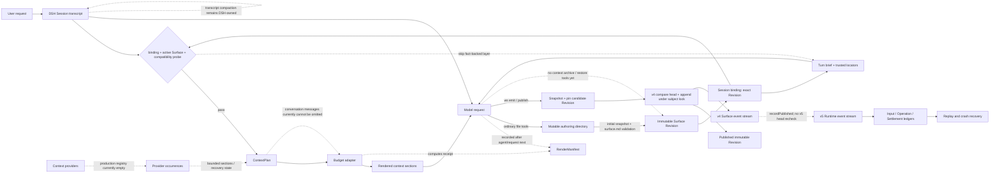
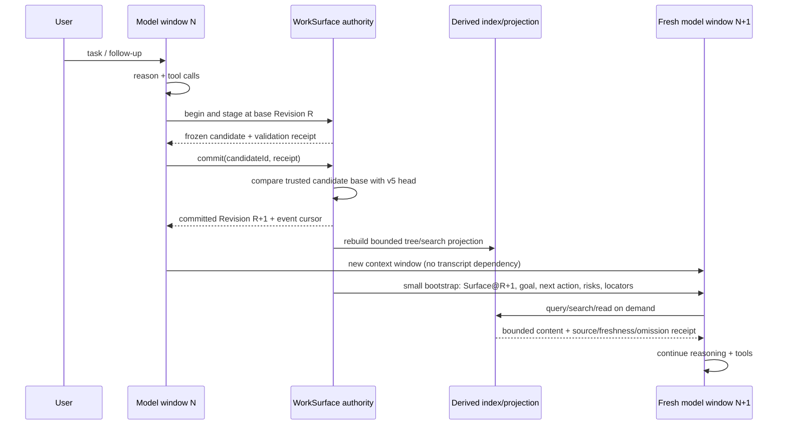
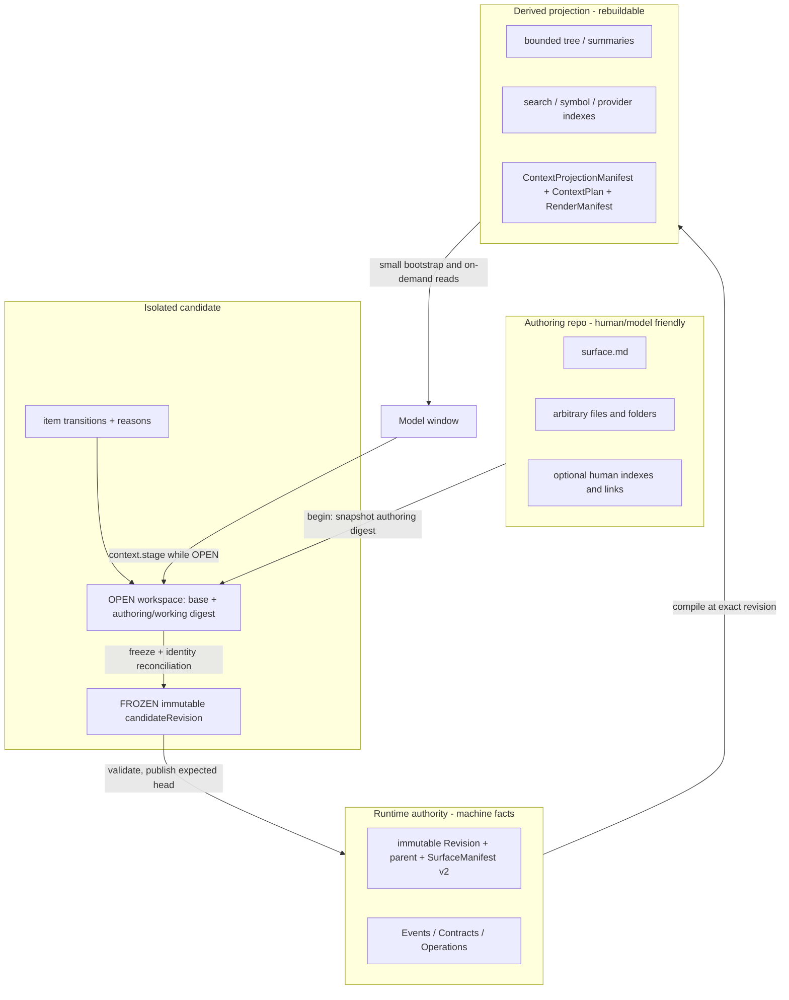
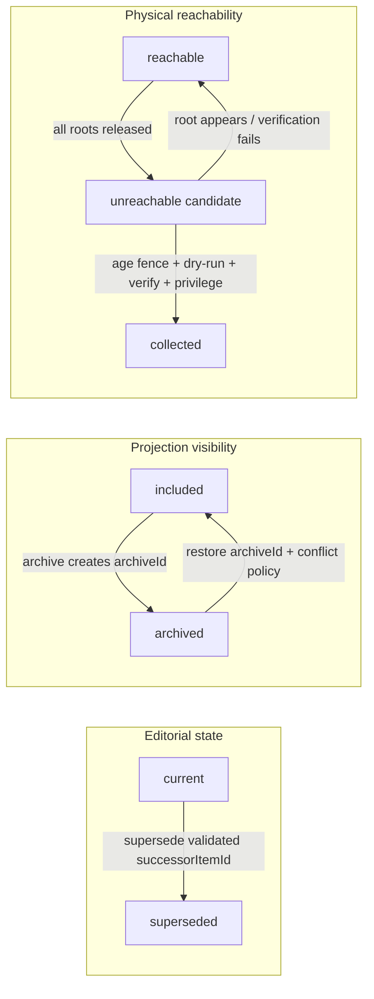

# WorkSurface Context-as-Repo 调研综合结论

审计日期：2026-09-04。本文综合固定源码、Git 历史、测试与官方资料，回答四个问题：

1. “Context as Repo” 到底应指什么；
2. 谁已经做过、从什么时候开始、成熟到什么程度；
3. WorkSurface 当前与这些系统的真实差异；
4. 下一版 repo 模板、Runtime 固定契约和模型工具应该如何收敛。

建议尚未写入 WorkSurface 代码或设计契约。文中的 **现状** 来自实现审计，**建议** 是下一步候选设计。

## 结论先行

你的判断成立，但需要把概念说得更精确：**WorkSurface 的方向不是“用文件代替 context window”，而是让 repo 成为可版本化、可寻址、可编译、可恢复的上下文权威；model window 只是它的一次有预算的投影。**

调研后的核心判断是：

1. **已经有人做；在本次审计样本中 Letta Code 最接近。** Letta 的公开代码在 2026-01-27 有文件式 memory projection，02-11 进入 Git-backed MemFS，02-12 正式发布 “Context Repositories”；此后逐步补上受控 mutation、compile-from-HEAD、post-turn sync、worktree recovery、层级 `MEMORY.md` 与 staged budget validation。这些是方向可行的实现证据，但完整系统不是“建一个目录”就完成。还要注意：compile-from-HEAD 来自 local v1 路径，层级 `MEMORY.md` 来自 API-backed v2；固定源码不能证明二者已统一成同一个 backend contract。
2. **社区更早实现或提出了局部机制。** Aider 从 2023-05 开始做 token-fitted repo map；MemGPT 在 2023-10 提出分层虚拟上下文；Anthropic 2025-09 系统化总结 just-in-time retrieval、progressive disclosure、structured notes 和 compaction；ACE 2025-10 研究增量 playbook。它们分别为 projection、外部记忆和渐进披露提供实现或研究证据，不等于完整 Context-as-Repo，也不等于生产采用。
3. **Codex 的新方案不是 Context-as-Repo。** 2026-06-11 的 #27488 只加 model-requested fresh window；06-23 的 #29743 才让 TokenBudget 手动/自动 compaction 都跳过摘要；08-21 的 #39827 才加 private backend History/Notes。它是 window-centric 的 “fresh window + private recall”，没有 Git、项目文件、revision manifest、archive/restore 或 repo authority。
4. **WorkSurface 模板仍有明显价值。** Letta 偏 agent memory repo，AICTX 偏固定分类的 coding continuity，Codex 偏私有会话恢复；在本次样本所比较的领域 authority/replay 维度，WorkSurface 的 Surface/Revision/Event/Contract/Operation 基础更完整，目标范围也是通用任务/execution surface，而不只是长期记忆。
5. **当前短板不在“缺更多文件夹”。** 真正缺的是：小而固定的 Runtime ABI、revision-pinned fragment/range refs、诚实的投影/检索 receipt、生产 provider、模型可用的 stage/publish/archive/restore，以及跨实例原子的普通 apply。
6. 用户留空的第 3 项，调研后最应补成：**revision / publication / recovery contract**。没有它，repo 结构与文件工具只能得到一个“可编辑目录”，得不到可靠的 Context-as-Repo。

## 什么才算 Context-as-Repo

这里的 “repo” 应理解为 repository semantics，不应被缩成 “Git 文件夹”。一个系统至少要形成以下闭环：

```text
durable authority
    + stable addresses
    + bounded/discoverable projection
    + mediated read/write
    + revisions/provenance
    + lifecycle/recovery
```

更具体地说：

- 完整上下文在 model window 之外长期存在；
- model 总能看到一个很小的入口，知道还能去哪里找；
- 每次自动装载都能指出确切 Revision、来源、摘要/范围和遗漏原因；
- model 可以按路径、fragment、range、record 或 provider ref 精确读；
- 写入先形成候选，再校验并以 expected head 发布；
- archive、supersede、restore、delete/GC 是不同机器状态；
- fresh window 或 crash 后，可以从 durable facts 重建，而不是只信旧摘要。

因此以下概念不能互换：

| 机制 | 能解决什么 | 单独不能证明什么 |
| --- | --- | --- |
| Compaction | 缩小对话表示 | 持久、可寻址、可审计的上下文 |
| Progressive disclosure | 控制何时加载正文 | 权威、版本、写事务、恢复 |
| Git-backed files | 历史与协作基础 | 领域事务、权限、语义 lifecycle |
| RAG/search | 找候选内容 | 内容真伪、发布与 archive 状态 |
| Repo map | 路由和导航 | repo authority |
| 把文件移到 archive 目录 | 改变物理位置 | 稳定身份、可逆恢复、保留策略 |

## 候选项目的分层判定

### A. 最接近完整方向

| 项目 | 判定 | 真正成熟的部分 | 主要缺口/边界 |
| --- | --- | --- | --- |
| Letta Code | 本次样本中最接近 Context-as-Repo 的公开产品实现 | Git-backed memory、bounded tree/core、受控 memory mutation、commit attribution；local v1 的 compile-from-HEAD/freshness；API-backed v2 的层级 index/staged constraints；post-turn sync 与 isolated worktree maintenance | 面向 agent memory 而非通用 execution surface；普通 mutation 的 expected-head/rollback 仍不完整；archive 主要是 prompt policy；上述 v1/v2 能力尚不能当成一个统一 backend 栈 |
| WorkSurface | 已有强 authority/recovery substrate，目标更一般 | content-addressed Revision、Event/Contract/Operation、v4 publish CAS、provider occurrence lifecycle、ContextPlan/RenderManifest、crash replay | 当前 ABI/refs/load policy/production provider/transactional apply/archive/restore/window checkpoint 未闭合 |

### B. 非常接近，但只覆盖一个产品面

| 项目 | 类型 | 应吸收的成熟实践 | 不应误读为 |
| --- | --- | --- | --- |
| AICTX | repo-local coding continuity runtime | canonical `resume/finalize`、bounded capsule、branch-sensitive loading、source/derived 与 local/portable split、why-loaded/freshness、capability profiles、dry-run retention manifest | 通用 arbitrary context repo；它是固定 JSON/JSONL taxonomy，普通写无统一 revision/CAS，archive 无普通 restore |
| Deep Agents | backend-composed agent filesystem/context runtime | 一个 BackendProtocol 映射 state/store/filesystem/remote context；大结果和压缩历史落入可检索地址；Skills metadata-first；ContextHub 有 commit/parent conflict retry | 所有运行态都在同一个 repo；checkpointer/state/store 仍是独立平面，通用 archive/CAS/lifecycle 未统一 |
| AgentPlane | typed context control plane | source/derived split、schema、provenance、freshness、bounded receipts；derived extraction roots 内的 multi-file stage/validate/promote/rollback | 默认自动 bootstrap 的 agent memory repo；prompt runner 与 context plane 仍分离；promotion 无 expected Git head，跨文件不 crash-atomic，也无启动 repair scanner |
| AIGNE AFS | provider/mount ABI | `/modules/<name>` 稳定地址、provider lifecycle、capability-driven tools、多种后端 | 强 revision/lifecycle/transaction authority；部分 bootstrap 文案未实际接线 |
| Memstead | schema-typed knowledge store | closed wire schemas、expected-hash mutation、dry-run 共用验证、typed errors、tool-roster drift tests、origin/trust 与 coverage receipts | trusted actor authorization 或通用可逆 archive |

### C. 成熟的相邻机制

| 项目 | 可借鉴点 | 边界 |
| --- | --- | --- |
| OpenHands SDK | append-only Events 与 disposable model View 分离；compaction 明确忘掉哪些 event；保护 tool-call/result 原子边界 | 摘要仍有损，旧事件没有成为模型可按需检索的 repo |
| Aider | PageRank/definition/reference 驱动的 token-fitted repo map；缓存与刷新 | 只是派生 code router，不是 authority |
| Codex TokenBudget + History/Notes | fresh window、budget awareness、trusted runtime identity、带 range/limit 的 list/read/search、4 KB bootstrap hint；backend 声明施加 output budget | private backend session state；客户端固定源码不能核验所有 backend hard caps；默认关闭实验；不是 host repo |
| ContextFS | content-addressed FS snapshot、branch、AgentState parent/dependency、durable latest ref、restore | 低层 checkpoint substrate，不负责语义 manifest/projection |
| Agent OS | owner-of-record map、稳定 Workstream id/status/revision 与 single-writer recheck 主要是文档/prompt protocol；receipt helper、局部 compare-before-write、doctor/backup 有实现和测试 | 不是自动 model context runtime；post-hoc receipt 不证明前序 mutation 原子 |
| agent-mem | 小型 `.context/`、pinned/summary/tree、bounded search、compact/forget | `read --full` 无硬上限；weak lock、路径/命令安全问题、没有 restore、merge/resolve 语义脆弱 |
| ACE / ACE Playbook | 小 delta grow-and-refine、稳定 bullet ids、usefulness counters；后者补了 ADD/UPDATE/REMOVE | 原 ACE 大部分 mutation operation 未实现；两者都不是 repo transaction |

小型 AgentsFS、context-repository、Skillfoundry Harness、agno-context、Git Context Controller 等仍提供角色标记、approval digest、provider registration 或 Git vocabulary 的局部样本，但不能用 README 名称推断成熟度或广泛采用。

## “已经有人用了”应如何表述

“代码存在”“项目自己默认启用”和“外部生产采用”是三件事。本次只能可靠证明前两项；所有候选的外部部署数、活跃用户数和实际使用率都仍是 **未知**。

| Rollout 级别 | 可以证明的项目内事实 | 不能外推的结论 |
| --- | --- | --- |
| Shipped-default（有范围） | Letta MemFS 自 2026-06-07 起在 capable backend 的普通新建 agent 中默认启用，07-03 移除普通 agent opt-out；Deep Agents 默认挂载 filesystem/summarization，并外置大结果和被摘要替换的历史；Aider RepoMap、OpenHands SDK condenser 也已进入各自适用范围的默认路径 | 只有 Letta 接近完整 Context-as-Repo；默认路径不等于外部广泛采用 |
| Shipped opt-in | AIGNE AFS、AgentPlane Local Context、Deep Agents `ContextHubBackend`、AICTX continuity runtime 都已公开发行，但需要显式配置、挂载或初始化 | 第一方集成、连续发版和 GitHub 热度不等于生产部署 |
| Early / experimental / template | Codex 组合能力仍是 default-off、受 eligibility 限制的实验；ContextFS 是年轻 substrate；agent-mem 是 Alpha；Agent OS 是协议模板；ACE 是论文原型，社区 ACE Playbook 是年轻独立实现 | 不能表述为产品已全面迁移到该架构 |

Deep Agents 还必须拆成两层：默认 filesystem/offload 是 Context-as-Files；真正有 commit/`parent_commit` 冲突重放的 `ContextHubBackend` 到 2026-05-12 才作为 LangSmith 第一方 opt-in backend 发布。AICTX 对 Codex、Claude、Copilot 的适配器是 AICTX 自己维护的兼容层，不是这些厂商的官方采用。完整证据与口径见 `34-adoption-evidence.md`。

## 时间线：谁什么时候开始做

下面时间统一按 UTC，只列对设计判断有区分度的节点；精确 PR、commit、证据类型见 `30-evolution-timeline.md`。

| 时间 | 项目 | 可验证事实 | 正确归类 |
| --- | --- | --- | --- |
| 2023-05/06 | [Aider v0.5.0](https://github.com/Aider-AI/aider/releases/tag/v0.5.0) | 05-19 起 ctags/repo map 实现，06-07 发布 PageRank/token-budget 版本；后续再演进到当前形态 | 本次样本中最早的成熟 repo projection/router 之一；不能把当前全部能力倒推到首版 |
| 2023-10-12 | [MemGPT paper v1](https://arxiv.org/abs/2310.08560) | 分层 memory 与 virtual context management（论文） | 概念前身，不是 repo protocol |
| 2025-07-29 | [Deep Agents `80338ed`](https://github.com/langchain-ai/deepagents/commit/80338eda64fd50179372a06f5ab5e6db11349b70) | state-backed `ls/read/write/edit` virtual filesystem | Context-as-Files 起点，不是版本化 repo |
| 2025-09-29 | [Anthropic context-engineering article](https://www.anthropic.com/engineering/effective-context-engineering-for-ai-agents) | just-in-time paths/queries、progressive disclosure、structured notes、compaction（方法文档） | 社区方法总结，不是一个统一实现 |
| 2025-10-06 | [ACE paper v1](https://arxiv.org/abs/2510.04618) | evolving playbook 与 incremental context（论文） | 语义 curation 方法 |
| 2025-10-17 | Deep Agents | long-term memory 与 large tool-result offload 进入 middleware | 正文外置 + 按路径恢复 |
| 2025-11-07 | Letta Code | Skills metadata inventory + body on demand | 文件式 progressive disclosure 前身 |
| 2026-01-27 | Letta Code | MemFS block/file sync、tree projection、hash/conflict | 文件化外部 memory |
| 2026-02-11 | Letta Code | 每 agent Git-backed memory repo | 公开代码中真正 context-repo 起点 |
| 2026-02-12 | Letta | 官方发布 “Context Repositories” | 产品命名和方向公告 |
| 2026-04-16/24 | AICTX | repo 创建；八天后 continuity store/loader/handoff/decision/failure | repo-local continuity 起点 |
| 2026-05-04/06 | Letta Code | committed HEAD → compiled prompt + revision cache | repo 成为可重复编译的 context source |
| 2026-05-11/12 | Deep Agents | `ContextHubBackend` 加入 commit/parent-conflict/retry | 版本化远端 context repo backend 起点 |
| 2026-06-11 | Codex #27488 | model-requested `new_context`，auto compaction 仍旧 | 无摘要换窗第一步 |
| 2026-06-23 | Codex #29743 | TokenBudget manual/auto 均 fresh window，不生成摘要 | “TokenBudget 干掉摘要”的准确日期 |
| 2026-07-03/06 | Letta Code | 普通 agent 默认 MemFS；worktree lifecycle 由 harness 收口 | 从能力走向默认 substrate/恢复协议 |
| 2026-08-21 | Codex #39827 | private History/Notes list/read/search/write | fresh window 的外部恢复层 |
| 2026-08-25 | Codex #40539 | 新 window 可注入不超过 4,000 bytes 的 `thread_hint` | 小 bootstrap + 大内容按需读闭环 |
| 2026-08-28 | Letta Code | 层级 `MEMORY.md` gating 与 staged size/depth constraints | repo layout/预算成为可执行契约 |
| 2026-08-17 起；08-30/31 重构 | WorkSurface | 08-17 初始化；08-18 已有 per-attempt authority；08-21 有 canonical publish；08-30/31 完成当前 durable-events/fact-backed 架构重构 | 不能把 08-31 误写成整个设计的首次起点 |
| 2026-09-03 | Codex 0.153.0 | 组合能力作为默认关闭实验公开 | 产品化时间，不是最初实现时间 |

这条时间线只能证明公开落点先后，**不能证明 OpenAI 抄了 Letta 或社区**。两个 Codex PR 的描述和 commit 中没有找到这类因果引用。

## WorkSurface 当前上下文图

实线表示已经存在的主要路径；虚线表示存在部分骨架、但尚未闭合或不在 WorkSurface 内负责。



### 图里最需要注意的四个事实

1. 在现代 DSH capability probe 通过时，model 可自动得到 **绑定的 immutable Revision 投影**，不是当前 mutable WIP 的即时 snapshot；probe 不通过时整层跳过，只剩 Brief/locator + 普通文件工具。
2. `surface.md` 是 required；其他 Surface 文件目前都是 `high + whole-item`，没有 repo-authored role/load policy。
3. ContextPlan/RenderManifest 是 as-of/inclusion receipt 骨架；conversation messages 实际仍全量派生，manifest 也未覆盖最终请求的所有 contributor，因此 WorkSurface 没有替代 DSH compaction，也不能声称它精确证明最终 model request。
4. provider occurrence 框架已实现主要路径，但生产 registry、roster/version identity、required-content 语义与部分恢复测试尚未闭合；archive/restore 与真正 maintenance apply 仍不存在。
5. Revision 可接纳任意普通文件，但当前 adapter 会盲目按 UTF-8 解码；没有真正的 media/modality 分类，也不会产生类型中已经预留的 `unsupported-modality` omission。

## 与用户给的 OpenAI 图有什么不同

参考图描述的是一个 **window 生命周期**：reasoning/tool results 累积，达到阈值后把过去压成 summary，下一段继续。最新 Codex TokenBudget 实验甚至把这个 summary 去掉，改成 fresh window，再通过 History/Notes 按需恢复。

WorkSurface 描述的是一个不同维度：**任务世界状态的 authority 生命周期**。

| 问题 | OpenAI 图 / Codex Context Management | WorkSurface |
| --- | --- | --- |
| 核心对象 | model conversation window | Surface Revision + Events + Operations |
| 超限动作 | summary compaction，或 TokenBudget fresh window | 当前由 DSH 管；WorkSurface 只观察 projection/trigger |
| 旧信息位置 | transcript/compaction item；实验中为 private History/Notes | immutable revisions、events、blobs、authoring WIP |
| 恢复方式 | thread hint + list/search/read private history/notes | exact bound revision + ContextPlan + file/provider locators + replay |
| 真相源 | 会话/backend state | Runtime-qualified Surface authority |
| 写入 | private Notes append/write | current publish/apply/event paths；目标应统一 stage/validate/publish |
| Archive | 无一等 archive/restore | 当前也没有，但已有适合承载它的 Revision/Event/Operation 基础 |
| 目标 | 让长对话继续推理 | 让上下文独立于任一窗口，并能审计/协作/恢复 |

所以更准确的关系是：

```text
Codex context management = model-window paging + private recall
WorkSurface              = revisioned world/context authority + compiled projection

两者可组合，但不是互相替代。
```

如果把 WorkSurface 的**目标形态**画成与参考图同一时间轴，应该是下面这样。注意这不是当前已完成的换窗实现，而是由调研支持的候选协议：



这里替代 “compressed summary” 的不是一篇更长的总结，而是一个已发布 Revision：小的 resume capsule 只负责导航；可以被验证、引用和继续读取的事实仍在 repo authority 中。

## 建议 1：repo 结构如何维护

### 不固定业务目录，固定三层



推荐结构原则：

- `surface.md` 保留为唯一必需的人类/模型入口，有硬大小上限；当前七标题保留为有价值的默认 WorkSurface 模板，但从不可演进的 Runtime 常量下沉为受信任、版本化的 `templateId + templateSchemaDigest` Contract。Runtime 固定验证所绑定 schema，不固定“所有未来 Surface 永远只有这七段”；
- 允许任意目录与文件，不把 `active/`, `archive/`, `evidence/`, `notes/` 等名字写死进 Runtime；
- role、load policy、trust、lifecycle 应映射到稳定 item identity，而不是由路径名暗示；
- `SurfaceManifest v2` 是被 Revision hash 覆盖的权威机器事实，由 Runtime 从 staged item operations 生成并验证，保存 `itemId -> path/blobDigest/mediaType/role/loadPolicy/visibility/editorialState/successorItemId`；不可由模型直接写；
- `ContextProjectionManifest` 是从 exact Revision、provider roster 和 projection policy 确定性生成的 derived view，可删可重建；它与 `SurfaceManifest` 不同名、没有 authority precedence；
- tree/index/search cache/report 都是 derived，可删可重建，不参与 authority equality；
- mutable authoring WIP、published Revision、model projection 三者必须在 UI/receipt 中明确区分。

为使 move/archive/restore 真正可实现，`SurfaceManifest` 还必须保存一层 Runtime-issued logical identity：

```text
surface-item(SurfaceId, itemId)                         # 跨 Revision 稳定身份
    --resolve at Revision R-->
surface-file(SurfaceId, R, itemId, path, sha256)        # 某 Revision 的物化位置
```

受控 `context.stage` 的 rename/move 保留 `itemId`；新文件由 Runtime 分配 id；删除留下 tombstone。对绕过工具的人工 working-copy 改动，只能让同路径继承原 id、新路径获得新 id，或要求显式 reconcile；不能用“内容相同”猜测 rename，因为重复文件会令身份含糊。共享 authoring WIP 只作为 begin 的输入：`begin(baseRevision, authoringDigest)` 将其快照为 **OPEN** 隔离 candidate，并对 base→snapshot 做 diff/identity reconciliation，生成 staged item transitions；stage 更新 working digest。`freeze` 才生成不可变 candidateRevision/digest 并关闭写入；validate/commit 只接受 **FROZEN** candidate，publish 不能直接读取仍在变化的共享目录。

### 自动装载不是目录扫描

Session admission 应由 DSH/Runtime 直接给出 trusted `SurfaceId@Revision`；Runtime 再从自己的 Revision authority 取 manifest 和 entrypoint。不要让模型或当前工作目录通过“找到某个 `.worksurface/` 文件”来决定自己绑定了哪个 Surface，这会把身份、隔离和 freshness 降级为路径猜测。

首轮装载建议固定为：

| 层 | 默认行为 | 失败语义 |
| --- | --- | --- |
| Runtime contract | system-level tool/authority rules，始终注入且很小 | 缺失则拒绝启动 Context-as-Repo mode |
| Trusted locator | Surface/Session/Revision/event cursor/manifest digest/capability | 不允许从 model text 覆盖 |
| Entrypoint | `surface.md` 在硬预算内完整装载 | 超限或结构无效则明确失败，不静默截断 required 内容 |
| Logical tree | role/path/description/status/size 的 bounded projection | 报 omitted children/depth，不假装完整 |
| Other active files | 默认 deferred，由 query/read/search 取回 | 每次返回 coverage/freshness/truncation receipt |
| Archived/scratch/untrusted raw/provider bulk | 默认不自动装载 | 只有显式 scope/capability 才可读 |

这样 Runtime 固定的是 cold-start 可达性，而不是把 repo 中“看起来重要”的文件全部塞进上下文。

### Runtime 最少必须固定知道的契约

| 固定 ABI | Runtime 为什么必须知道 | 不应让 model/文件声称的字段 |
| --- | --- | --- |
| `schemaVersion` | 升级与拒绝未知语义 | 兼容策略 |
| trusted `SurfaceId / SessionId / actor / capability` | 隔离、授权、审计 | actor 与权限 |
| current Revision、parent、event cursor、expected head | freshness、CAS、replay | 当前权威 head |
| one entrypoint (`surface.md`) | 保证 cold start 可理解 | entrypoint 是否可信/绑定到哪个 Surface |
| canonical ref types | 精确定位 file/fragment/range/record/blob/provider | 跨 Surface/mount 权限 |
| role + load policy + lifecycle metadata | 自动装载、过滤、archive | privileged lifecycle transition |
| provider registry snapshot | 知道地址空间、能力、freshness、required/optional | provider identity/capability |
| projection receipt schema | 说明看到/没看到什么 | source revision/digest |
| staged mutation + validation + publish protocol | 防 lost update、半写与污染 | expected head/approval identity |

建议新增的 canonical refs 至少包括：

```text
surface-item(surfaceId, itemId)
surface-item-version(surfaceId, revision, itemId, blobDigest)
surface-file(surfaceId, revision, itemId, path, blobDigest)
surface-fragment(surfaceId, revision, itemId, parserId, parserVersion, fragmentId, fragmentDigest)
surface-range(surfaceId, revision, itemId, byteStart0, byteEnd0Exclusive, blobDigest)
surface-record(surfaceId, revision, itemId, adapterId, adapterVersion, schemaDigest, recordId, recordDigest)
session-event(sessionId, seq, contentHash)
blob(blobId, contentHash)
provider-resource(providerId, locator, resourceRevision, digest)
```

`surface-item` 是可跟随 lifecycle 的逻辑引用；其他 ref 是不可变、可审计的版本化 materialization。range 使用原始 blob 的 0-based、half-open byte offsets，文本行列只作为带 encoding/newline policy 的派生显示 receipt。读取逻辑引用时，调用方仍必须给出 `atRevision` 或明确的 consistency policy，不能静默解析到“当前最新”。provider implementation version 与 read consistency 属 receipt/query policy，不属于资源身份；provider 若不能历史解引用，则进入 durable authority/projection 的正文必须先按 digest ingest 为 immutable blob，provider ref 只保留 provenance。

## 建议 2：上下文管理工具如何映射到文件

下面先固定 **逻辑操作面**，不急着冻结成恰好三个物理 tool。三个 dispatcher 可能减少名字，也可能因巨大 union schema 更贵、更难授权；应以目标 provider 的 schema/token benchmark 比较“三个 dispatcher”和“多个小工具”。若采用 dispatcher，每个 action 必须是 closed discriminated `oneOf`（`additionalProperties: false`），handler 端重新校验 capability；投影 receipt 记录实际 tool-roster/schema digest。下列带点名称也只是占位，发布前要验证目标 provider 的 tool-name 约束。

### A. `context.query`

```text
actions: overview | tree | list | stat | read | search | resolve | diff | history
```

| Action | 读取哪个平面 | 必须返回的 receipt |
| --- | --- | --- |
| `overview` | `SurfaceManifest` + derived `ContextProjectionManifest` + `surface.md` 摘要 | exact revision、两个 manifest hash、budget、roles/mounts |
| `tree/list` | derived bounded tree over one Revision/mount | depth/child/cursor limits、omitted count、completeness |
| `stat` | immutable manifest entry/lifecycle metadata | digest、size、media type、role、status、provenance |
| `read` | Revision blob or provider resource | resolved canonical ref、range、truncation、freshness |
| `search` | revision-pinned derived index / bounded provider query | query、scope digest、index revision、scanned/known counts、next cursor、truncation reason；unknown total 要明确 |
| `resolve` | logical role/link → canonical ref | resolution chain、target revision |
| `diff/history` | Revision/Event authority | base/head、parents、omitted binary/large data |

`tree/list/search/resolve` 默认只查 `visibility=included`，但在 capability 允许时必须支持显式 `visibility=archived|all`、`editorial=current|superseded|all` 与 `archiveId/itemId`，否则模型归档后无法发现并恢复。所有 cursor 都绑定 exact Revision、scope digest 和 lifecycle-policy digest。

### B. `context.stage`

```text
actions: begin | write | patch | move | archive | restore | supersede | freeze | discard
```

`begin` 创建 OPEN candidate；其他 mutation action 只作用 OPEN candidate 并返回 prospective manifest/diff，不直接移动权威 head。`freeze` 可以是 Runtime 自动步骤或一个显式 action，但必须产生不可变 candidateRevision 并使该 candidate 不再可写。

candidate 不是临时目录名：Runtime 必须持久化 `candidateId + state(OPEN|FROZEN) + baseRevision + authoring/working digest + candidateRevision/digest + operationId + staged item transitions`。每次 OPEN edit 更新 working digest；freeze 后的 validate/commit 按 digest 读取同一个不可变快照。任何继续编辑都会产生新 candidate revision，并使旧批准/校验 receipt 失效。

| Action | 文件层效果 | 权威语义 |
| --- | --- | --- |
| `begin` | 将指定 `authoringDigest` 或 published Revision 快照为 OPEN 隔离 candidate | 分配 candidate/operation id，绑定 base head，计算 base diff/identity transitions；不推进 authority |
| `write/patch` | candidate 中新增/修改 file/fragment | staged only，带 reason/source refs |
| `move` | candidate 中只更新当前 Revision 的 `itemId -> path` mapping | logical ref 无需重写；历史 path/version refs 永远不改；repo 内可解析链接只做校验/diagnostic |
| `archive` | 可选择物理投影视图，但不要求真的 `mv` | `visibility → archived`；editorial state 不变；默认 projection 排除；bytes/provenance 保留 |
| `restore` | 由 Runtime 根据 `archiveId/itemId` 解析 source record，恢复到目标 path/role | archived → included，记录 restore reason 并处理 path conflict；模型不负责声明权威 source Revision |
| `supersede` | 可留原文件或投影到历史视图 | `editorialState → superseded`，visibility 不变，并指向 successor ref |
| `freeze` | 将 OPEN workspace 固化为 content-addressed candidate Revision | 关闭写入，返回 candidate digest；旧 working receipt 不再可用于新 candidate |
| `discard` | 丢弃 candidate edit | 不影响 published authority，记录 staged outcome 即可 |

### C. `context.publish`

```text
actions: validate | commit
required on validate: candidateId, candidateDigest
required on commit: candidateId, candidateDigest, validationReceiptId
optional echo: expectedRevision (diagnostic only; trusted value comes from candidate record)
```

`validate` 与真实 commit 共用 authority hard checks：path/schema/reference integrity、item/lifecycle invariants、capability、不可变依赖与硬字节/媒体上限；返回绑定 candidate digest、base Revision 和 policy digest 的 prospective Revision/receipt。易变 provider freshness 与当前模型 token budget 只属于 projection-readiness warning，不能阻止合法事实发布；若 provider 内容是权威依赖，须先 ingest 为 immutable blob。`commit` 先 durable-record operation intent，再在 authority lock 内重验 candidate digest、policy 与 expected head，并只推进唯一权威 head；working-copy materialization、兼容投影和 derived index 在锁外按 committed Revision 重建，最后幂等 settle。这样 rebuild 失败不会回滚或污染已经确定的 authority 事实。

### 不应暴露给普通模型的动作

- physical delete / garbage collection；
- force publish / force merge / unlock；
- 修改 provider registry、trust policy、retention policy；
- 跨 Surface capability grant；
- 伪造 actor/approver/session/head；
- 直接写 generated manifest/index/receipt/event log。

## Archive 应该如何工作

调研中多数项目在这里最弱：Letta 主要依赖 reflection prompt，Axiom 把 `archive` 当目录名，agent-mem 的 forget 会搬文件但没有 restore，AICTX 只有 retention compaction，AgentPlane 的 deprecated/superseded 状态最接近语义 lifecycle。

建议定义如下：



这是 **语义 lifecycle**，不是物理对象可达性。每类 durable ref 必须声明 `strong/dereference-required` 或 `weak/tombstone-only` 及 retention horizon：只有 retained strong refs 构成 roots；历史 event/receipt 超过保留期后可按显式 policy 降级为只留 digest/tombstone 的 weak ref，此后不得再承诺能解引用正文。roots 至少包括 current heads、pins、精确 Session bindings、仍可 restore 的 ArchiveRecords、pending operation/candidate、以及 in-flight read/render/materialization leases。GC 基于原子的 root snapshot/lease barrier；只有完全不可达对象通过最小年龄、dry-run、verify 与 privileged approval 后才可 sweep。`Archived` 本身绝不意味着 `GCEligible`，但把所有 append-only event 永久当 strong root 也会导致永不回收。

关键约束：

1. item 有稳定 logical id；path 只是某 Revision 下的表示。`editorialState=current|superseded` 与 `visibility=included|archived` 是正交字段，所以一个 superseded item 仍可 included 或 archived。
2. archive 是 Revision 内的 visibility 转换，会从默认 projection 中排除，但 bytes、digest、来源、历史与 replacement link 保留；它产生稳定 `archiveId`。
3. restore 是普通可逆事务；模型提供 `archiveId/itemId + target/conflictPolicy + reason`，Runtime 自己解析 source Revision 并处理 path conflict。
4. archive/restore 都先 stage，再验证引用、successor/循环、依赖与 authority invariants，最后条件发布；projection budget 只影响默认可见投影，不改变 lifecycle 事实是否合法。
5. delete/GC 是独立的 storage reachability protocol，不能作为普通模型工具，也不能把 archive 自动等价为最终删除；只要任一 retained strong ref 或在途 lease 仍引用 item bytes，就不得回收。
6. successor 必须是同一 authority 下可解析的 item，拒绝 successor cycle；move 只改变当前 Revision mapping，不重写历史 ref。
7. ContextPlan/RenderManifest 用 bounded lifecycle receipt 说明默认 policy 排除了 archived items；大仓库只返回 policy digest/count/cursor，不为每个未加载 item 生成无限 omission 列表。

每次归档还要产生一等 immutable authority record：

```text
ArchiveRecord {
  archiveId, surfaceId, itemId, sourceItemVersionRef,
  archivedRevision, priorPath, priorRole, lifecycleSeq
}
```

`archiveId` 由 Runtime 分配；candidate `SurfaceManifest` 只保存该 id 与 visibility，避免把包含自身 Revision 的 record 哈希进 Revision。candidate Revision 算出后，权威 compare-and-append event 再原子携带完整 `ArchiveRecord`（含 `archivedRevision`）。重复 archive/restore 以 `archiveId` 做幂等判定；多轮 archive→restore→archive 会得到可区分的 records，restore 解析指定 record，而不是猜“最近一次移动的文件”。

## 建议 3：Revision / publication / recovery contract

这是 repo 结构与工具之外最重要的一层。

### 正常事务

```text
read trusted Surface@Revision from the single v5 head owner
  -> begin(baseRevision, authoringDigest) in an isolated candidate
  -> stage edits/lifecycle deltas
  -> freeze immutable candidateRevision
  -> validate(baseRevision + candidateRevision + policyDigest)
  -> durable OperationPrepared(idempotencyKey) before authority side effects
  -> v5 compareAndAppend(expectedHead, candidateRevision) under one cross-instance lock
  -> release authority lock
  -> durable outbox conditionally materializes authoring view and rebuilds v4/index projections
  -> idempotent Settlement
  -> return committed Revision + projection-readiness receipt
```

初始创建也不能例外：显式 `create/admit(expectedHead=null, authoringDigest)` 必须走同一个 snapshot → reconcile → freeze → validate → Prepared → compare-and-append 流程。`head()` 退化为纯读；无 head 返回 not-found，不能再用 mutable authoring 隐式 `readOrAdmitHead()`。

这里必须先选一个 head owner。建议 **v5 RuntimeEventStore 是唯一权威 Surface head**：v4 Session publish 只负责形成 immutable candidate，再调用 v5 publish；旧 `surface.revision.published/conflicted` 变成由 v5 event 生成的兼容投影，不再独立决定 head。迁移需要在同一个跨实例锁内完成：确认 v4/v5 heads 一致、旧 writer 已隔离或租约失效，然后写 durable `headOwnerEpoch=v5/<cutover>` 栅栏。marker 生效后拒绝所有 v4 authority writes，所有 bind/head read 改读 v5；v4 只接受携带 v5 commit ref 的幂等 projection/repair。没有 writer fencing 的一次性 startup compare 不足以完成切换。

`OperationPrepared` 必须 put-if-absent，并不可变绑定 `{operationId, idempotencyKey, surfaceId, base/expectedHead, candidateId, candidateRevision, candidateDigest, validationReceiptDigest, policyDigest, actor/approval, outboxIntent}`；同 key 不同内容必须拒绝。权威 publication event 原子携带 operation id/key 与关键 digests，恢复时用该 event 判断“这个操作已提交”，不能只比较 `head == candidateRevision`，因为相同内容可能由另一个操作发布。

outbox 物化 authoring 时必须再次比较当前 working-copy digest 与 begin 时的 `authoringDigest`。相等才 compare-and-replace；若人或工具已产生新 WIP，就保留原目录，把 committed view 物化到独立只读位置，并 settle 为 `authoring-conflict/materialization-pending`。authority 已提交后绝不覆盖新 WIP，也不回滚 head。

### 并发与冲突

- candidate record 由 Runtime 绑定 `baseRevision/expectedHead`；model 可以回显 expected Revision 作为乐观前置条件，但 Runtime 必须以 trusted candidate record 为准并比较，不能信任模型声称的 head；
- 跨实例锁内只做唯一 head store 的 compare-and-append；不要假装 authoring rename、Revision objects、Event、Settlement、index rebuild 能组成一个跨存储 ACID transaction；
- 背景 curator 使用 isolated candidate/worktree，不能直接改 active authoring repo；
- 冲突要返回 typed outcome：stale-head、candidate-changed、validation-failed、merge-conflict、partial-settlement、projection-not-ready 等；
- Runtime 必须注入 actor/session/capability/head，model 只提供 target、content/delta 和 reason。

### Crash 恢复

- immutable candidate 可以预先写入；在推进 authority head 前必须 durable-record `OperationPrepared`，成功 compare-and-append 后只允许 forward recovery；
- startup 扫描 pending operation，并以匹配本 `operationId/idempotencyKey` 的 commit event 判定结果：找到该 event 时，无论 head 后来又推进到哪里都必须 forward-recover projection/settlement；找不到时，即使 head 已被另一操作推进，本 candidate 仍可幂等 settle 为 stale/conflict/aborted；
- derived index/report 可以重建，不能成为恢复唯一依据；
- torn append、prepared 但 head 未推进、head 已推进但 authoring/v4/index 未重建、event 已写但 settlement 未落盘，都要有测试。

### 与 model window reset 的边界

fresh window 不是 repo archive，也不应重置 process/tool/working-tree state。允许换窗前，Runtime 应保证：

1. 不能在未完成的 tool-call/result 对中切窗；最后完整 tool boundary 必须可定位。
2. 当前 mutation 允许三态：已 publish、明确 discard、或 durable checkpoint 为 pending candidate/WIP（记录 candidate/authoring digest、base head、dirty paths、last completed tool boundary 与 locators）；不能为换窗强迫丢掉合法长期 WIP。
3. active WorkSurface Revision、event cursor 与 pending candidate locator 已形成 Runtime 可恢复 checkpoint；settlement/rebuild 不依赖模型剩余 token。
4. 下一窗口能得到小 bootstrap（Surface/Revision/goal/next action/risks/pending state/locators）；scheduler 预留的是完成边界工具调用、接收结果与下轮 bootstrap 的空间，而不是靠模型在最后一刻写总结。

## 哪些上游实践值得直接吸收

按优先级排序：

1. **Letta：`committed revision -> compiled prompt revision`。** local v1 证明 exact HEAD 驱动编译/freshness；API-backed v2 证明层级 index/constraints；maintenance 有隔离 worktree 和 typed outcome。借鉴机制，不假设两个 backend 已统一。
2. **AgentPlane：derived extraction 的 stage/validate/promote/rollback。** 借鉴其多文件校验与失败回滚，但补 expected head、durable prepared record 和 startup repair；不要把它原样称为 crash-atomic authority transaction。
3. **Memstead：tool ABI 就是产品契约。** closed schema、expected hash、dry-run 同验证、typed error、origin/trust、coverage/truncation receipts、roster drift tests。
4. **AICTX：bounded resume + why-loaded + quality。** cold start 不扫目录；同时说清来源、freshness、unverified/missing 和 fallback。
5. **OpenHands：authority 与 model projection 分离。** compaction 是投影事件，不能删除原始事实；tool call/result 不应被切开。
6. **Aider：budgeted derived router。** 路由 map 应从 exact Revision 生成，使用多信号排序并报告刷新/省略。
7. **AIGNE/Deep Agents：provider/backend ABI。** 统一 mount/address/capability，但长期 context repo 与短期 execution/checkpointer 仍应分层。
8. **Agent OS/ContextFS：receipts 与 recovery substrate。** Agent OS 的 owner map/single-writer 多为协议，已测试的是 receipt/局部 helper；ContextFS 提供 content-addressed dependencies 与 durable latest-ref/GC 基础。两者都不能替代上层 expected-head transaction。

## WorkSurface 相对上游的真正差异

### 已经领先或更有潜力的地方

- authority-qualified Surface identity，不依赖 model 声称身份；
- content-addressed immutable Revision，不把 Git working tree 当唯一真相；
- Contract/Event/Operation/Settlement 可支持领域级 transaction 和 crash replay；
- provider occurrence 有 phase、lifetime、timeout、required、stable settlement 顺序；
- ContextPlan/RenderManifest 已有 as-of 与 included/omitted receipt 骨架；
- scope 是通用 work surface，可承载任务状态、输入、输出、evidence 和协作，不局限于 agent personal memory。

### 当前明显落后的地方

- Letta 已有可用的层级 discovery/index + controlled memory tooling；WorkSurface 仍只有 `surface.md` + arbitrary file candidates；
- AICTX 已有标准 `resume/finalize` 和 quality report；WorkSurface 的 cold-start projection 与 lifecycle tool 仍未形成面向 model 的稳定产品 ABI；
- AgentPlane 的 derived extraction validation/rollback 与 Memstead 的 expected-hash/dry-run/error receipt 在各自范围更闭合；WorkSurface v5 ordinary apply 和 `recordPublished()` 仍有原子性/契约错配；
- AIGNE/Deep Agents 已有实际 provider/backend implementations；WorkSurface production provider registry 为空；
- 当前没有 archive/restore，也没有 checkpoint-before-new-window；
- conversation messages 不可 omit，预算估算粗糙且没有 output/tool/publish reserve。

## 推荐的首版收敛顺序

### P0：先把 authority 写安全

1. 先收敛单一 head owner：v5 增加跨实例 `compareAndAppend`；在 writer fencing 后持久化 cutover epoch，v4 publication 降为只携带 v5 commit ref 的兼容投影。不能只给后置 `recordPublished()` 加 CAS，否则 v4 已成功、v5 拒绝时会制造分叉。
2. 删除 read-time implicit admission；初始 `create/admit(expectedHead=null)` 与普通更新共用 immutable candidate、policy-bound validation、put-if-absent `OperationPrepared`、authority compare-and-append、outbox/forward recovery 和幂等 Settlement。
3. 共享 authoring WIP 只能经 `begin(baseRevision, authoringDigest)` 进入 OPEN candidate，再 freeze；publish 不直接读取变化中的目录。commit 后物化也须 compare digest，冲突时保留 WIP。用 two-runtime、old-writer-after-cutover、crash-at-every-boundary 与 stale candidate 测试锁定。

### P1：固定最小 Context ABI

1. 生成/验证权威 `SurfaceManifest v2` 与可重建 `ContextProjectionManifest`，加入 stable item id；当前七标题作为版本化默认模板 Contract，不再是不可演进常量。
2. 新增精确定义的 item-version/fragment/range/record/provider refs、strong/weak retention class 与 `ArchiveRecord`；volatile provider 正文若进入 durable state 先 ingest blob。
3. 每个 ContextPlan/RenderManifest 记录 source revision、provider/tool roster digest、included/omitted/stale/truncated/failed reason，并明确它目前不是完整最终请求 receipt。
4. 增加 media type/modality、binary 默认 omit、真实 `unsupported-modality` receipt、provider/model adapter 与硬字节上限。
5. 给预算器加入 model tokenizer 或可校准估算，以及 output/tool-result/resume-bootstrap reserve。

### P2：做真正的渐进披露

1. `surface.md` + bounded logical tree 自动 bootstrap。
2. 实现 revision-pinned `query/read/search/diff`，结果诚实报告 completeness/freshness。
3. 实现一个原生 Revision router/derived-index provider；不要重复把 Surface authority 包成第二 provider。外部 provider catalog 从 capability registry 生成并绑定 roster digest。
4. maintenance 是独立 durable Operation worker，不伪装成只会贡献 context sections 的 provider。

### P3：补 lifecycle 与长任务换窗

1. 实现 staged archive/restore/supersede 与 active projection filtering。
2. 将 GC 保持为 privileged maintenance。
3. 在 DSH/WorkSurface 交界实现 tool-boundary-safe durable checkpoint、pending-WIP locator、small resume capsule 与 fresh-window protocol。
4. 用 crash、stale-head、two-runtime competition、provider-upgrade、archive/restore/path-conflict/GC-root 测试锁定。

## 最终判断

不应该因为 Letta、Codex、AICTX 等已经出现就放弃 WorkSurface 模板。相反，本次审计样本没有找到一个同时闭合以下四个交界面的实现：

```text
arbitrary human-friendly repo
        ×
small machine-verifiable ABI
        ×
runtime authority and transactions
        ×
bounded model projection and lifecycle
```

但模板必须克制：**Runtime 固定的是契约，不是目录学；repo 保存的是权威上下文，不是另一份不可核验的摘要；archive 是可逆状态，不是移动文件；模型写入的是 candidate，不是直接改 head。**

如果按这个方向收敛，WorkSurface 与 Letta/AICTX 的关系不是简单重复：它会吸收已有实现支持的 repo-local memory/disclosure 机制，并在 DSH 内补成通用、可事务、可恢复的 context authority。
